# RACESTARS

Corridas de podracer para telemóvel (Android) num **mundo aberto de 24 × 24 km**, com 16 zonas
de 6 km cada: deserto de arenito, fenda vermelha, picos, costa, colinas verdes, savana, maciço com
ilhas flutuantes, lagoa, selva do cenote, prado do aqueduto, dunas, vale dos arcos, floresta gigante,
planície de sal, vale dos cristais e oásis.

O mundo tem colinas por todo o lado e serras à volta das estradas. As estradas correm pelos vales.
Há **mais de 100 mil plantas e rochas** (florestas cerradas de pinheiros e árvores gigantes, savana de acácias,
palmeiras nos oásis, cactos no deserto, cristais) e nada é animado, para o telemóvel aguentar.
No horizonte há **estruturas colossais**, que se vêem a muitos km:
- guardiões de pedra com ~290 m;
- o esqueleto de um animal gigante, por baixo do qual a estrada passa;
- uma nave caída;
- anéis e arcos de pedra por cima da estrada;
- agulhas de rocha, árvores, cogumelos e cristais gigantes;
- ilhas flutuantes.

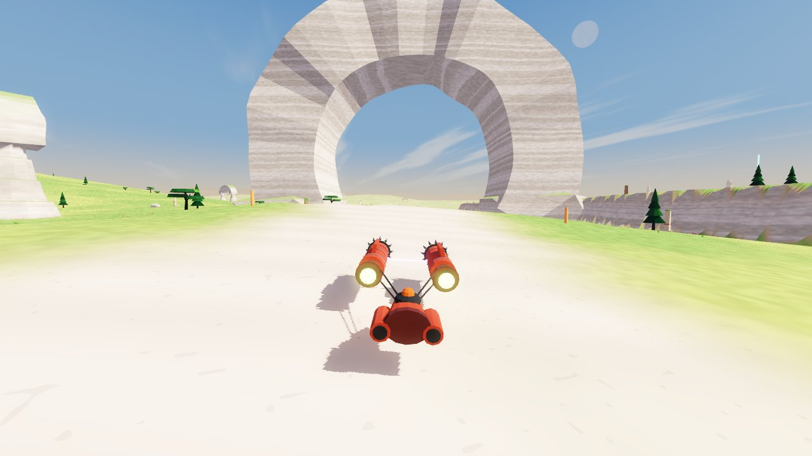

## Modos de jogo

- **EXPLORAR O MUNDO**: andar à vontade, sem relógio. O botão **MAPA** mostra o mundo inteiro (com as largadas das corridas): toca num sítio e viajas para lá.
- **CORRIDAS**: contra o relógio, cada uma com o seu recorde guardado no aparelho.
  - **GRANDE CORRIDA (de A até B)**: passa por **todas as zonas** (~116 km, 30 portões).
    Em cada trecho há caminhos alternativos em níveis diferentes: túneis, pelo chão, pelo alto, pela água.
    Ganha quem descobrir o melhor caminho.
  - **CIRCUITO DA FLORESTA** (3 voltas de ~9,7 km): túnel por baixo de uma colina, ponte sobre um rio,
    salto numa ravina, alameda de árvores gigantes e a árvore-mundo no meio.
  - **CIRCUITO DOS MONUMENTOS** (3 voltas de ~7,9 km): anel e arco colossais por cima da pista, túnel numa mesa,
    salto numa fenda, guardiões, e uma pirâmide com obeliscos no meio.
  - **RETA DO SAL** (arranque de 3 km): a direito na planície de sal, com placas de aceleração alternadas e pilares de cristal.
  - As **placas de aceleração** (setas no chão) dão um empurrão. Estão sempre em retas.
- **JOGAR A DOIS** (PvP local): dois ou mais telemóveis na mesma rede Wi-Fi (ou ligados ao hotspot de um deles).
  - Um escolhe **CRIAR**, o outro **ENTRAR**: a procura é automática e também se pode escrever o endereço.
  - O anfitrião escolhe **EXPLORAR JUNTOS** ou a pista (**PISTA ▸** troca) e **COMEÇAR A CORRIDA**.
  - Cada jogador tem a sua cor e o nome por cima do veículo.
  - Os outros jogadores aparecem no minimapa e no mapa grande.

## Instalar no telemóvel (Android)

Descarregue `apk/RACESTARS.apk` no telemóvel e toque em **Instalar**
(se pedir, permita "instalar apps de fontes desconhecidas"). Jogue com o telemóvel deitado.

**Controlos:**
- **Minimapa** redondo que roda com o veículo (a frente fica sempre para cima); o **N** na borda mostra o norte.
- **Metade esquerda do ecrã**: botões **◀ ▶** para virar. O veículo acelera sozinho.
- **Metade direita**: **TRAVÃO DE MÃO**.
  - Tira pouca velocidade.
  - Travar e virar ao mesmo tempo faz **derrapar** e fechar a curva a alta velocidade.
  - Uma derrapagem longa dá um impulso no fim.
- **A nave mexe-se:** levanta o nariz a subir, baixa-o a descer, inclina nas curvas e nas encostas,
  a suspensão encolhe nas aterragens e o nariz levanta nos impulsos. A câmara acompanha.
- **Choques:** bater não pára. O veículo ressalta e perde velocidade. As pedras baixas no chão não são obstáculos: passa-se por cima.
- **Quedas:** quem cai num abismo volta ao caminho mais perto de onde estava.
- **CÂMARA** troca entre perseguição e primeira pessoa.
- **MAPA** abre o mundo inteiro.
- **II** é a pausa: continuar, voltar ao caminho/portão, recomeçar e menu.

## O mapa

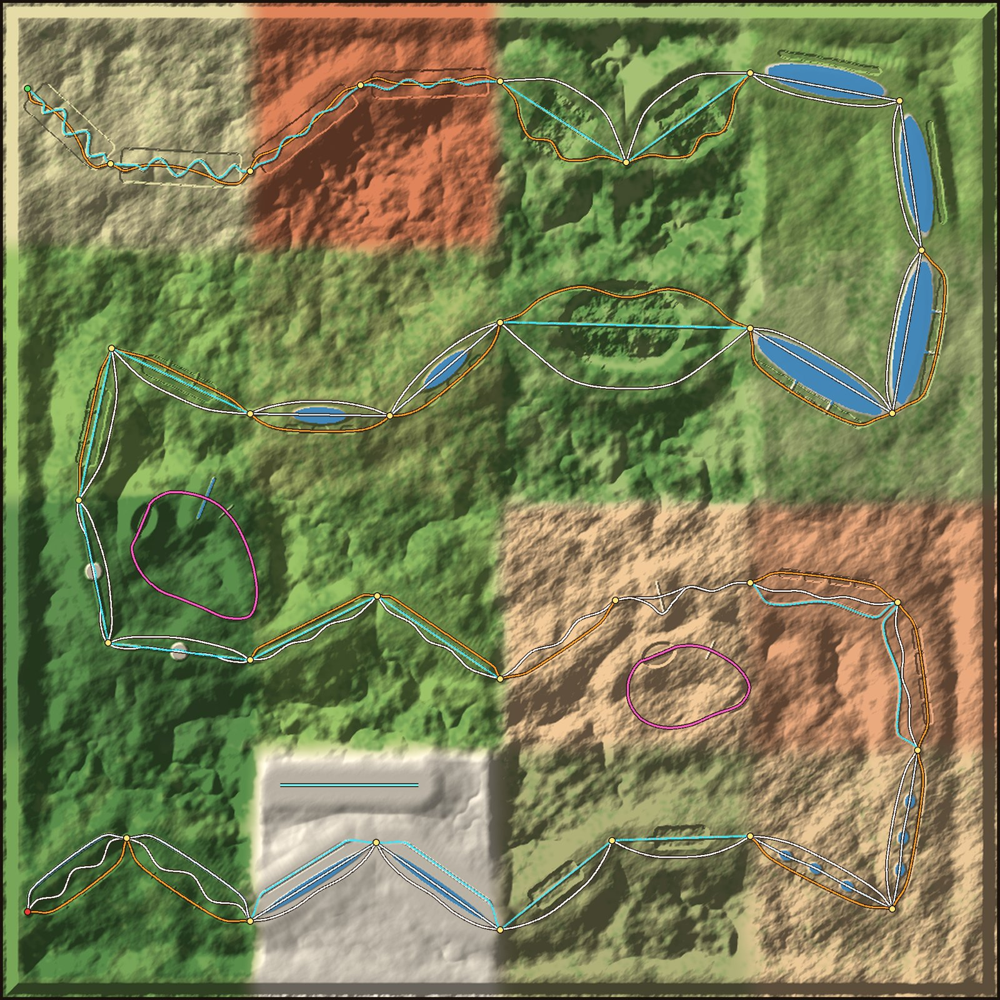

- Cada cor de linha é um nível:
  - azul: túneis e grutas;
  - branco: chão;
  - laranja: pelo alto;
  - azul-claro: pela água.
- Os pontos amarelos são os portões.
- As voltas cor-de-rosa são os dois circuitos; a reta azul na planície de sal é a Reta do Sal.
- Ao entrar numa zona aparece o nome dela no ecrã.

| | |
|---|---|
| 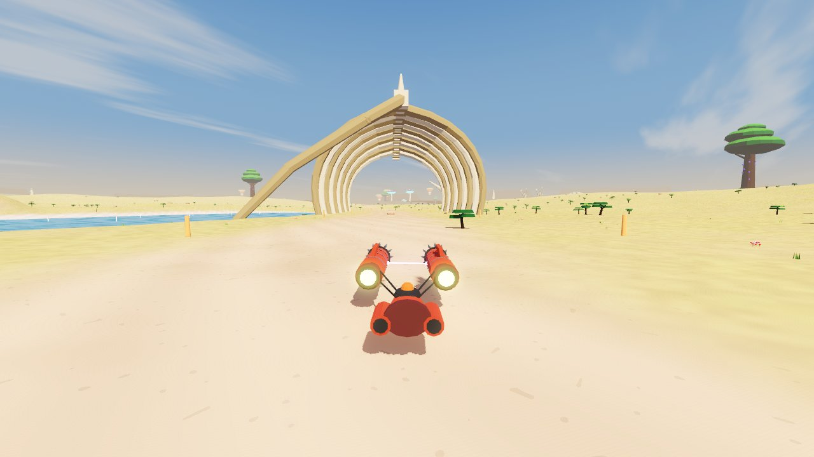 | 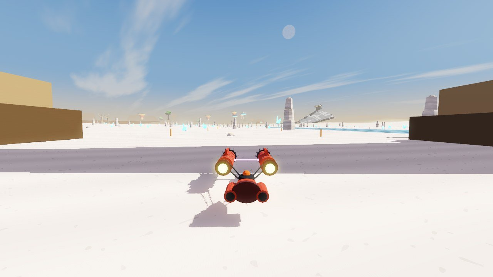 |
| 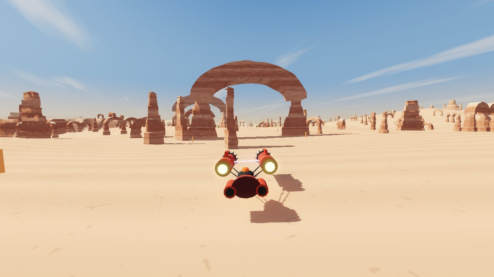 | 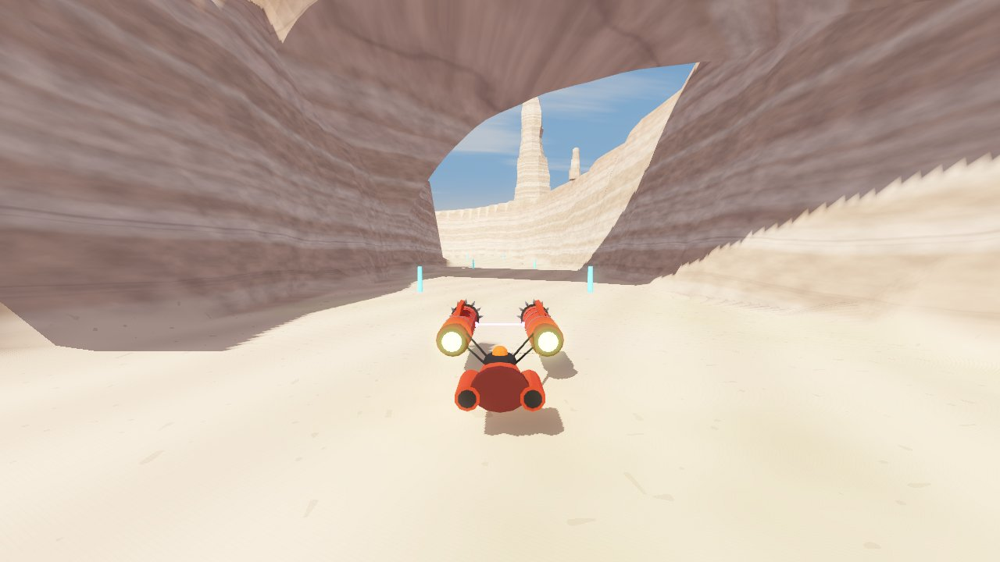 |
| 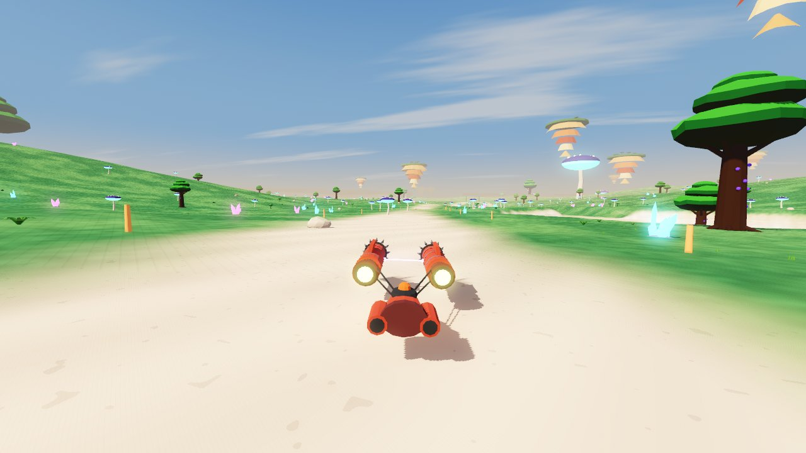 | 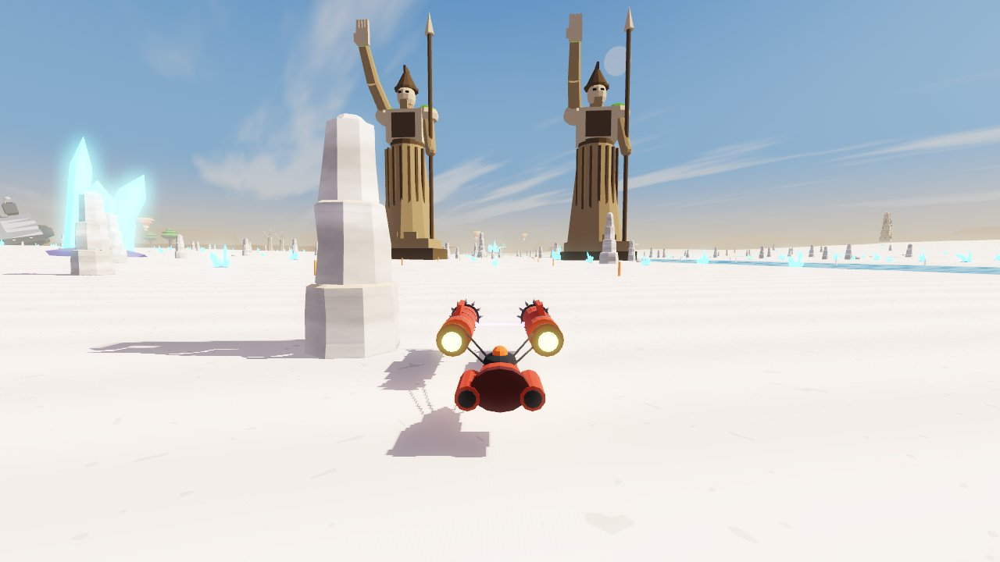 |
| 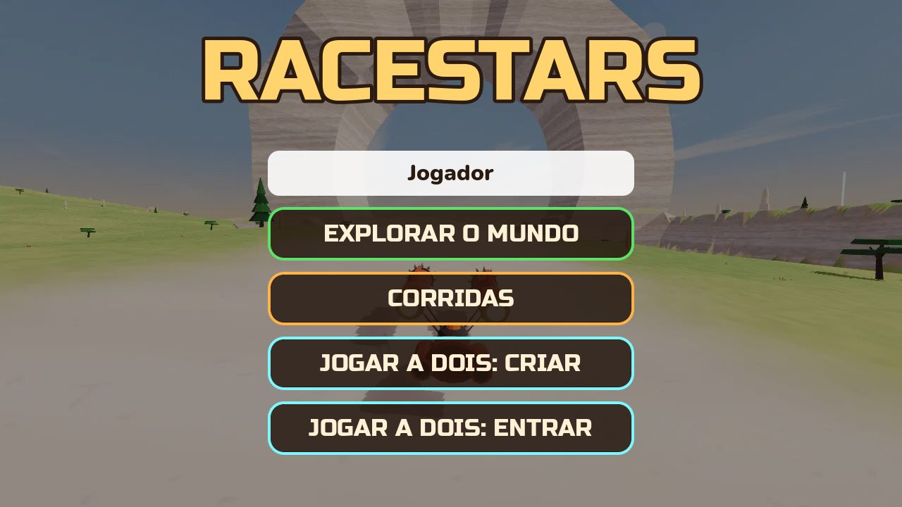 | 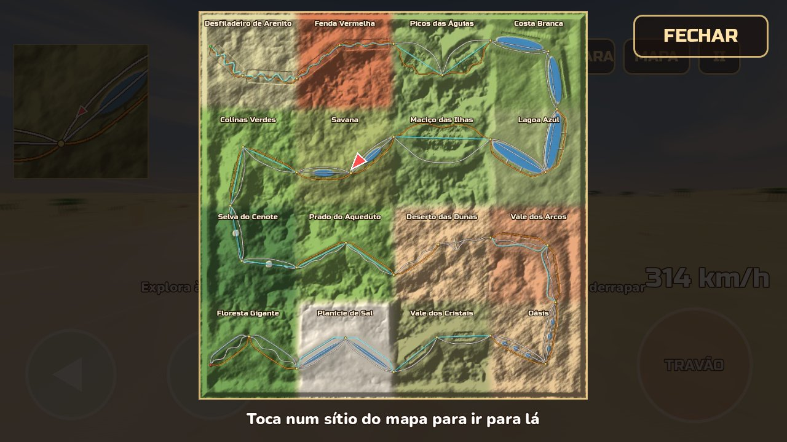 |

**As corridas novas:**

| | |
|---|---|
| 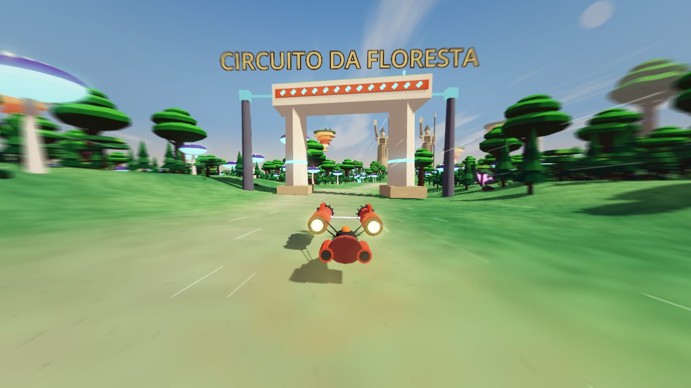 | 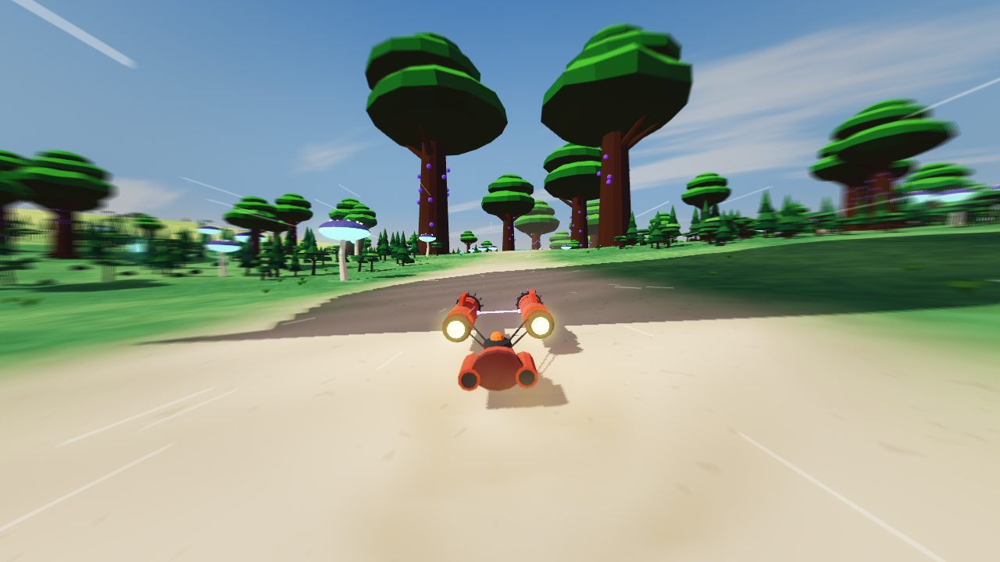 |
| 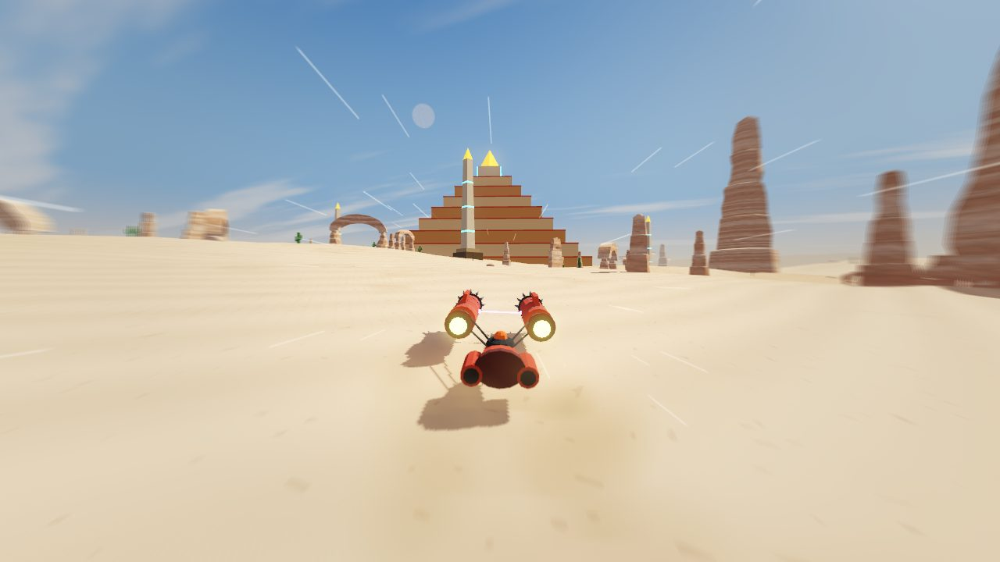 | 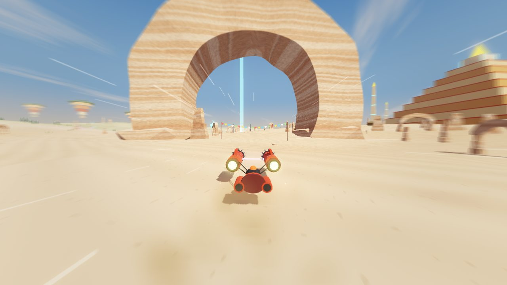 |
| 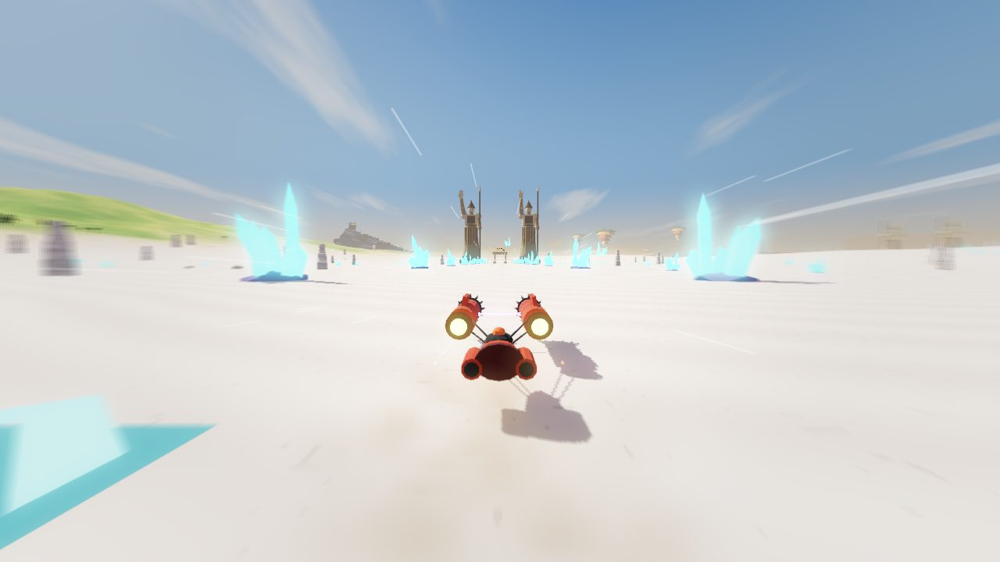 | 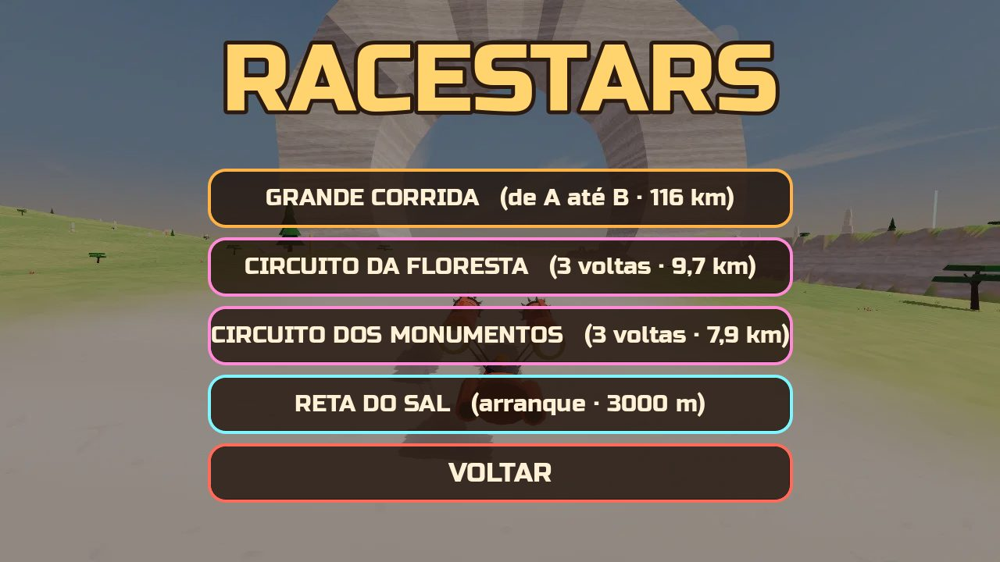 |

**Desempenho no telemóvel:**
- **Terreno sem engasgos:** nada é construído durante o jogo. São 5 grelhas planas partilhadas, e a placa gráfica lê a altura de cada ponto de uma textura.
- **Tudo estático:** sem animações nas plantas e nos animais. As peças são desenhadas em grupos e só até à distância a que se vêem.
- **Colisões leves:** são criadas diretamente no servidor de física.
- **Mapa comprimido:** alturas em passos de 12,5 cm, comprimidas com zstd.
- **Qualidade automática:** se o telemóvel não aguentar, a qualidade baixa sozinha.

## Estrutura

| Pasta / ficheiro | O quê |
|-------|-------|
| `tools/make_map.py` | **Gera o mundo**: terreno, as 16 zonas, os trechos com os caminhos de cada nível, os dois circuitos e a reta, túneis, pontes, aqueduto, lagos, colinas, serras, estruturas colossais, biomas, vegetação (veg.zst), peças e minimapa. No fim **verifica todos os caminhos**: buracos, paredes e túneis, pontes e aqueduto tortos |
| `blender/build_assets.py` | **Modela no Blender** todas as peças: rochas, arcos, árvores, ruínas, animais, os colossos, os túneis e as pontes à medida do mapa, e o podracer "Vespa" |
| `blender/racestars_assets.blend` | As peças lado a lado para abrir/editar no Blender (5.0+) |
| `tools/make_sounds.py` | Sintetiza todos os sons e a música |
| `game/` | Projeto Godot 4.5 (renderizador Compatibility, pensado para telemóvel) |
| `game/scripts/menu.gd` | Menu: explorar, corridas (escolher a pista), jogar a dois (criar/entrar) e sala de espera |
| `game/scripts/net.gd` | PvP local: criar/entrar, procurar jogos na rede, sincronizar o modo e o estado dos veículos |
| `game/scripts/race.gd` | Explorar e as corridas (A até B, circuitos com voltas, arranque): contagem, cronómetro, portões, voltas, recorde por pista, renascer no caminho, viajar pelo mapa |
| `game/scripts/terrain.gd` | Terreno 24 × 24 km deslocado na placa gráfica, com níveis de detalhe |
| `game/scripts/map.gd` | Coloca as peças, os colossos, túneis, pontes, aqueduto, água, ilhas, vegetação, bandeirolas, portões, pórticos de largada e placas de aceleração |
| `game/scripts/podracer.gd` | Física do podracer (flutua, derrapa com o travão de mão, salta, flutua na água, placas de aceleração), animação do corpo (inclinação, suspensão) e controlos de toque |
| `game/scripts/remote_racer.gd` | Veículo de outro jogador (PvP), suavizado |
| `game/scripts/hud.gd` | Cronómetro, portões, minimapa com zoom, mapa grande, nome da zona, pausa, botões de toque |
| `game/shaders/` | Céu, terreno e rochas com cores por bioma, água, colossos com neblina leve, borrão de velocidade |

## Gerar tudo de novo

```bash
pip install numpy scipy pillow zstandard bpy==5.0.1
python tools/make_map.py              # mundo (game/assets/map/) — mostra os problemas encontrados nos caminhos
python blender/build_assets.py        # peças .glb (túneis e pontes à medida de map.json)
python tools/make_sounds.py           # sons
```

## Gerar o APK

```bash
godot --headless --path game --export-release "Android" ../build/RACESTARS-unsigned.apk
java -jar uber-apk-signer.jar --apks build/RACESTARS-unsigned.apk   # assina (v2/v3)
```

## Testes automáticos (opcional)

```bash
# circuito completo com piloto automático por um dos caminhos de cada trecho (0, 1, 2 ou "sorte"), mais rápido que o tempo real
godot --headless --path game --fixed-fps 60 -- --mode=corrida --autoplay --log --variant=1 --quit=3600
# as pistas curtas: --event=floresta | monumentos | drag
godot --headless --path game --fixed-fps 60 -- --mode=corrida --event=floresta --autoplay --log --quit=900
# explorar a partir de um ponto (x,z,direção[,altura]) ou viajar para um sítio do mapa
godot --path game -- --mode=explorar --at=-700,1150,1,0 --fpv
godot --path game -- --mode=explorar --travel=5000,3000
# PvP com duas janelas no mesmo computador
godot --path game -- --host --players=2 --mode=explorar
godot --path game -- --join=127.0.0.1
```
