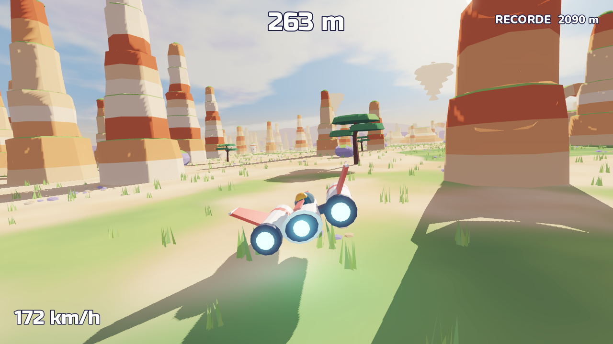
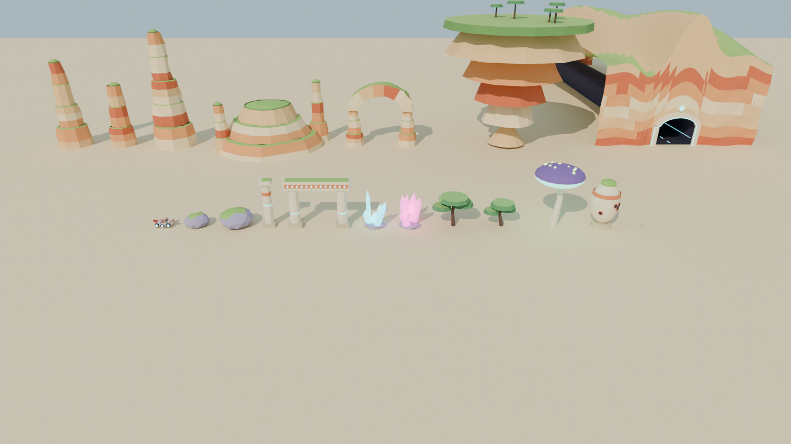

# RACESTARS

Jogo de corrida mobile: sempre para frente, desviando de obstáculos em alta velocidade,
num mundo alienígena enorme (inspirações: Race the Sun, Oban Star Racers, Avatar).



## Instalar no celular (Android)

Baixe `RACESTARS.apk` (gerado em `build/`) no telemóvel e toque em **Instalar**
(se pedir, permita "instalar apps de fontes desconhecidas"). Jogue com o celular deitado.

**Controles no celular:** segure o lado esquerdo/direito da tela para desviar (ou arraste o dedo).
Toque para começar e para recomeçar.

## Como abrir no PC (para editar)

1. Baixe o **Godot 4.5** (grátis): https://godotengine.org/download
2. Abra o Godot → **Importar** → escolha `game/project.godot`.
3. Aperte **F5** (ou o botão ▶).

**Controles:** `←` `→` ou `A` `D` · no celular/mouse: segure o lado esquerdo/direito da tela, ou arraste.
`Espaço`/toque para começar e para recomeçar depois de bater.

## O que tem na demo

- **Mapa infinito** para frente e **infinito para os lados** (gerado em pedaços de 80 × 80 m ao redor do jogador).
- A cada 1,5 km vem uma **cordilheira com túneis** (um túnel a cada 60 m de largura): ela não acaba para os lados,
  então é preciso entrar num túnel — e lá dentro não dá para ir para os lados (cristais para desviar).
- Dois biomas que se alternam: **savana de arenito** (colunas, mesas, arcos, acácias, torres) e
  **vale dos cristais** (cristais, cogumelos gigantes, portais antigos).
- Velocidade aumenta com o tempo; bateu, acabou. Recorde salvo no aparelho.
- **Mapa vasto**: arcos de pedra gigantes (passa-se por baixo), arcos duplos, anéis de pedra,
  lâminas de rocha e formações enormes no horizonte, além de "avenidas" de arcos em fila.
- **Sensação de velocidade**: rastros de vento, poeira, rastro das turbinas, borrão nas bordas,
  câmera que abre e treme com a velocidade, e um "zum" + vibração ao passar rente a um obstáculo.
- **Som**: motor que sobe com a velocidade, vento, música, eco dentro dos túneis e batida.
- Qualidade se ajusta sozinha se o celular não aguentar (desliga borrão e depois sombras).
- Sem poderes: só correr e desviar.

## Estrutura

| Pasta | O quê |
|-------|-------|
| `game/` | Projeto Godot 4.5 (renderizador Compatibility, pensado para celular) |
| `game/scripts/world.gd` | Gera o mapa infinito, biomas, cordilheiras e túneis |
| `game/scripts/player.gd` | Veículo, controles (teclado/toque) e piloto automático de teste |
| `game/shaders/` | Céu pintado (sol, nuvens, planeta, cordilheiras distantes) e chão |
| `game/assets/models/` | Peças exportadas do Blender (`.glb`) |
| `blender/build_assets.py` | Script que **modela no Blender** todas as peças e o veículo, com cores |
| `blender/racestars_assets.blend` | As peças lado a lado para abrir/editar no Blender (5.0+) |
| `concept/` | Arte conceitual |
| `screenshots/` | Prints da demo |



## Gerar o APK

```bash
godot --headless --path game --export-release "Android" ../build/RACESTARS-unsigned.apk
java -jar uber-apk-signer.jar --apks build/RACESTARS-unsigned.apk   # assina (v2/v3)
```

Os sons são sintetizados por `tools/make_sounds.py` (precisa de numpy).

## Regerar as peças do Blender

```bash
blender -b -P blender/build_assets.py -- --preview     # com Blender 5.0+ instalado
# ou
pip install bpy==5.0.1 && python blender/build_assets.py --preview
```

Depois abra o projeto no Godot (ele reimporta os `.glb` sozinho).

## Testes automáticos (opcional)

```bash
godot --path game -- --autoplay --seed=2 --shots=3,8 --shotdir=/tmp/prints --quit=10
```

`--autoplay` liga o piloto automático, `--start=1150` começa perto da primeira cordilheira,
`--shots` tira prints nos segundos indicados.
