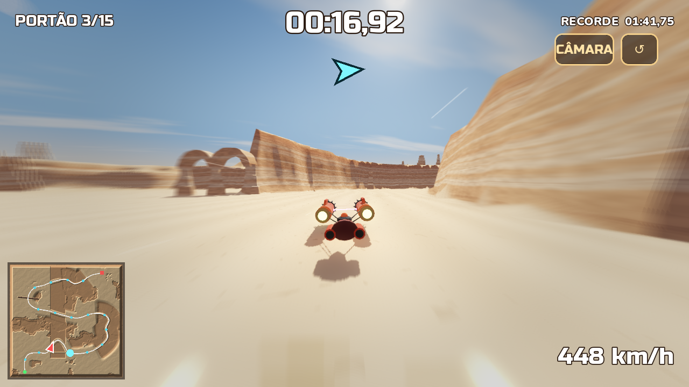
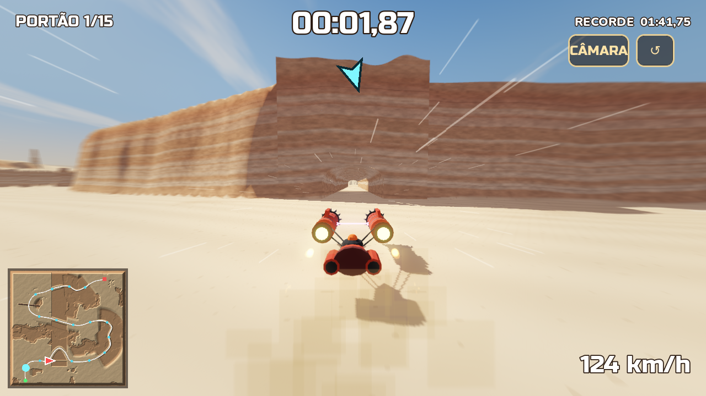
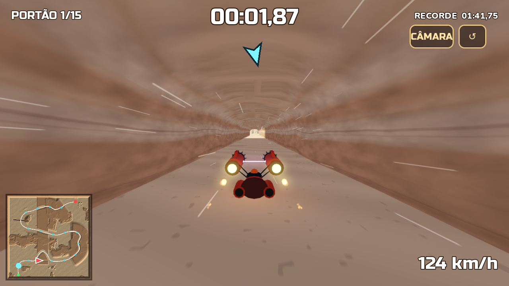
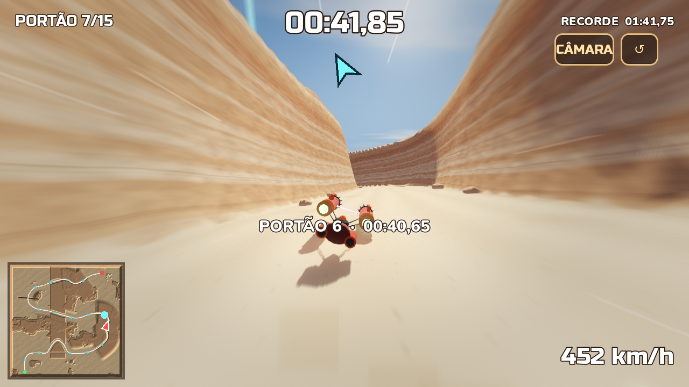
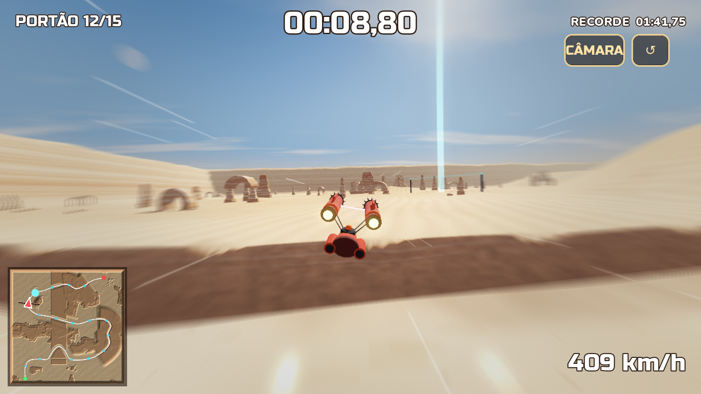
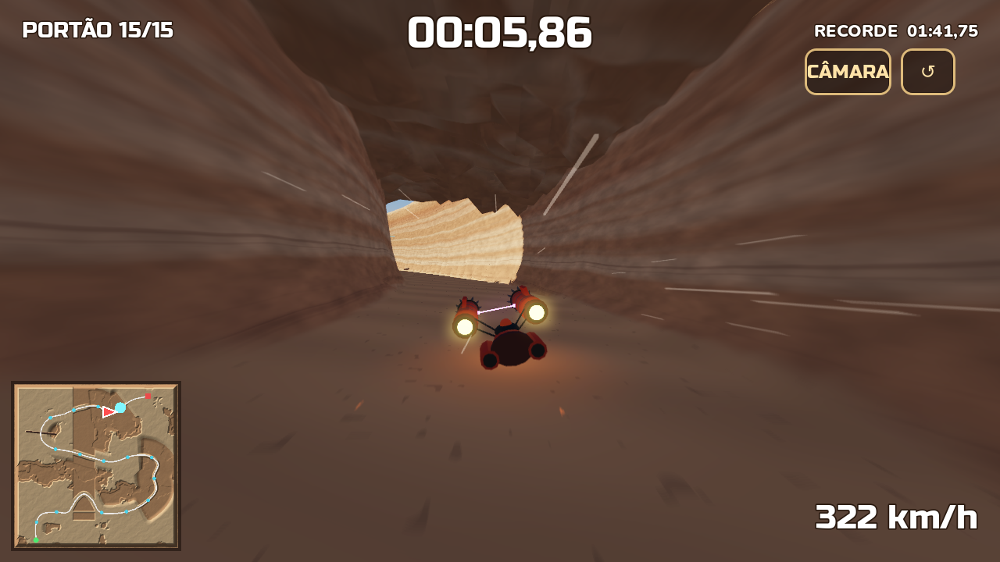
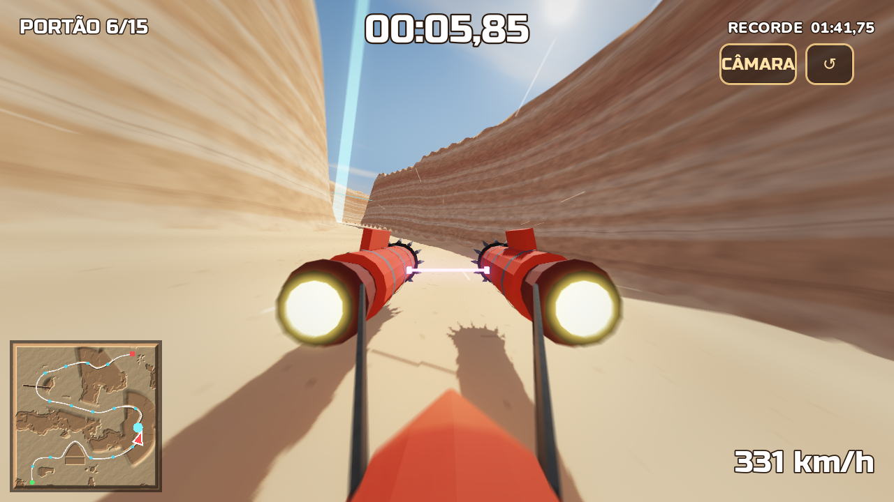

# RACESTARS

Corrida de podracer para telemóvel (Android): **contra o relógio, de A até B**, num deserto
gigante de 4 × 4 km. Pode ir para onde quiser — cortar caminho, subir dunas, saltar o abismo,
atravessar a gruta —, mas tem de passar pelos **15 portões em ordem** até à meta.


## Instalar no telemóvel (Android)

Descarregue `apk/RACESTARS.apk` no telemóvel e toque em **Instalar**
(se pedir, permita "instalar apps de fontes desconhecidas"). Jogue com o telemóvel deitado.

**Controlos:** segure o lado esquerdo/direito do ecrã para virar (ou arraste o dedo);
os dois lados ao mesmo tempo = travar. **CÂMARA** troca entre câmara de perseguição e
primeira pessoa (cabine). **↺** recomeça a corrida.

## A corrida


Da largada (verde, em baixo à esquerda) até à meta (vermelho, em cima à direita), ~11 km de percurso:

1. **Deserto aberto** com colunas e arcos de pedra.
2. **A mesa e a gruta**: a estrada dá a volta à mesa; quem tiver pontaria entra na **gruta** e corta caminho.
3. **Desfiladeiro** largo com paredões em camadas.
4. **Campo de arcos** de pedra (passa-se por baixo).
5. **Abismo**: rampa e vala funda a atravessar a pista — salta-se a 400 km/h (ou contorna-se).
6. **Dunas** com pequenos saltos.
7. **Desfiladeiro estreito com teto de pedra** (caverna com luz ao fundo) e **meta**.

- Fora da estrada vale tudo: o mapa inteiro é livre (montanhas nas bordas).
- Coluna de luz azul = próximo portão; seta no topo e minimapa ajudam a não perder o rumo.
- Raspar nas paredes faz perder velocidade; bater de frente (ou cair no abismo) volta ao último portão.
- O melhor tempo fica guardado no aparelho.

| | |
|---|---|
|  |  |
|  |  |
|  |  |



**Sensação de velocidade:** até 450 km/h, riscos de vento, poeira levantada, chamas das turbinas,
borrão nas bordas, câmara que abre e treme com a velocidade.
**Som:** turbinas que rugem e sobem de tom, vento, música, contagem 3-2-1, sinal nos portões,
fanfarra na chegada, raspões, batidas e eco dentro da gruta.

## Estrutura

| Pasta / ficheiro | O quê |
|-------|-------|
| `tools/make_map.py` | **Gera o mapa**: alturas do terreno, percurso, portões, mesa da gruta, abismo, posição das rochas e minimapa |
| `blender/build_assets.py` | **Modela no Blender** todas as peças (rochas, arcos, mesa com gruta, teto da caverna, o podracer "Vespa"), com cores |
| `blender/racestars_assets.blend` | As peças lado a lado para abrir/editar no Blender (5.0+) |
| `tools/make_sounds.py` | Sintetiza todos os sons e a música |
| `game/` | Projeto Godot 4.5 (renderizador Compatibility, pensado para telemóvel) |
| `game/scripts/race.gd` | Corrida: contagem, cronómetro, portões, recorde, voltar ao último portão |
| `game/scripts/terrain.gd` | Terreno 4 × 4 km em pedaços com níveis de detalhe |
| `game/scripts/map.gd` | Coloca as peças do Blender, a gruta, o teto, os portões e as balizas |
| `game/scripts/podracer.gd` | Física do podracer (flutua, derrapa, salta) e controlos de toque |
| `game/scripts/camera_rig.gd` | Câmara de perseguição e primeira pessoa |
| `game/scripts/hud.gd` | Cronómetro, portões, minimapa, seta, botões |
| `game/shaders/` | Céu do deserto, areia/rocha em camadas do terreno e das rochas, borrão de velocidade |

## Gerar tudo de novo

```bash
pip install numpy scipy pillow bpy==5.0.1
python tools/make_map.py              # mapa (game/assets/map/)
python blender/build_assets.py        # peças .glb (lê o tamanho da gruta de map.json)
python tools/make_sounds.py           # sons
```

## Gerar o APK

```bash
godot --headless --path game --export-release "Android" ../build/RACESTARS-unsigned.apk
java -jar uber-apk-signer.jar --apks build/RACESTARS-unsigned.apk   # assina (v2/v3)
```

## Testes automáticos (opcional)

```bash
# piloto automático do início ao fim, com registo e capturas de ecrã
godot --path game -- --autoplay --log --shots=5,20,45 --shotdir=/tmp/prints --quit=110
# começar no portão N, ou num ponto qualquer (x,z,direção) e em primeira pessoa
godot --path game -- --autoplay --cp=11
godot --path game -- --at=-700,1150,1,0 --fpv
```
