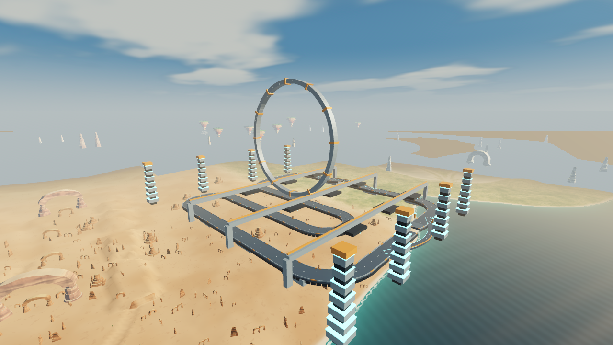
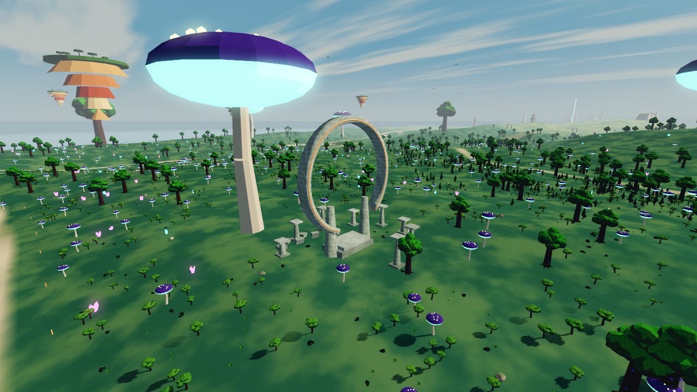
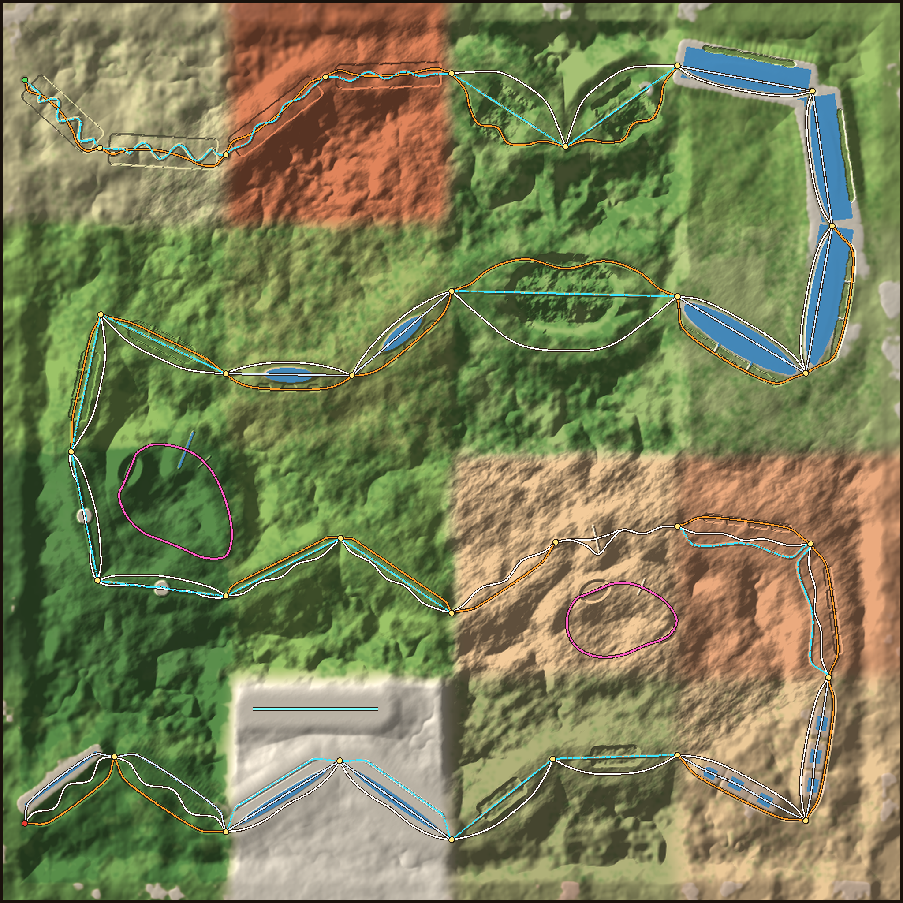

# RACESTARS

Corridas de podracer para telemóvel (Android) num **mundo aberto de 24 × 24 km**, com 16 zonas
de 6 km cada: deserto de arenito, fenda vermelha, picos, costa, colinas verdes, savana, maciço com
ilhas flutuantes, lagoa, selva do cenote, prado do aqueduto, dunas, vale dos arcos, floresta gigante,
planície de sal, vale dos cristais e oásis.

O mundo é uma ilha irregular rodeada de mar, com baías, enseadas, penínsulas e praias entre as 16 zonas.
Tem colinas por todo o lado e serras à volta das estradas. As estradas correm pelos vales.
Há **mais de 100 mil plantas e rochas** (florestas cerradas de pinheiros e árvores gigantes, savana de acácias,
palmeiras nos oásis, cactos no deserto, cristais). O vento nas copas, as bandeiras e as aves são animados
por shaders, com alcance limitado, sem simulação individual de cada planta.
No horizonte há **estruturas colossais**, que se vêem a muitos km:
- guardiões de pedra com ~290 m;
- o esqueleto de um animal gigante, por baixo do qual a estrada passa;
- uma nave caída;
- anéis e arcos de pedra por cima da estrada;
- agulhas de rocha, árvores, cogumelos e cristais gigantes;
- ilhas flutuantes.


## Comando PS4 / PS5 — 0.12

Ligue o comando por USB ou Bluetooth ao PC. **Analógico esquerdo/direcional** vira;
**L2 ou Quadrado** trava; **Triângulo** recupera; **Círculo** troca a câmera;
**Options** pausa. Nos menus, **X** confirma e **Círculo** volta. A aceleração é
automática. As setas do teclado também funcionam. [Controlos e validação](docs/controllers.md).

## Física e recuperação — 0.11

A nave acompanha subidas e descidas, inclina o casco nas rampas e mantém inércia
nos saltos. As margens da água deixam de ter paredes invisíveis e as aterragens
recebem amortecimento. A câmera acompanha os declives e balança suavemente.

**RECUPERAR** no ecrã ou **R** no PC devolve a nave a uma superfície segura sem
reiniciar a corrida. A recuperação também atua após seis segundos sem avançar;
manter o travão pressionado desativa essa deteção. [Detalhes e testes](docs/physics-011.md).

## Perfil Samsung A15 / Estável — mantido na 0.12

No seletor de gráficos do menu, escolha **Gráficos: A15 (30 FPS)**. O jogo reconhece
as famílias SM-A155 (4G) e SM-A156 (5G), ativando o perfil na primeira atualização
se a preferência anterior era Leve. Escolhas posteriores ficam guardadas.

A meta é 30 FPS com física a 60 Hz. O mundo 3D usa resolução adaptativa, enquanto
menus e botões permanecem na resolução normal. Vegetação pequena/distante,
sombras e detalhe dos materiais custam menos; árvores grandes, construções,
trajetos e colisões são preservados. Não há garantia de 30 FPS em todo aparelho;
90 Hz de ecrã não equivale a 90 FPS de renderização.

[Comparação e medições](docs/a15-profile.md). O APK continua compatível com as
versões anteriores para atualização e com o multiplayer PC/Android.

## Novidades 0.9

Em **CORRIDAS → CIDADELA TITÃ**, encontra um circuito suspenso de 7,19 km,
com duas voltas, pista de 84 m, curvas fechadas, dois saltos e desvios laterais.
O anel orbital tem 740 m de diâmetro, entre torres e passadiços monumentais.
Oito bosques acrescentam árvores de 60–150 m à selva e à floresta.

O caminho central dos dois primeiros trechos tem margens alargadas até 128 m,
com transições mais estreitas onde há pontes e suporte do caminho superior.
Raspões preservam a velocidade ao longo da parede; suspensão e aterragens estão
mais estáveis. A aceleração, velocidade máxima, direção e derrapagem mantêm os valores.


[Ver salto](screenshots/09-05-salto.png) · [Ver floresta](screenshots/09-06-floresta.png) · [Testes e detalhes](docs/adrenaline-09.md)

**PC contra Android:** usem a mesma versão e rede Wi-Fi/hotspot. Um escolhe
**REDE LOCAL: CRIAR**, os restantes **REDE LOCAL: ENTRAR**. Até quatro jogadores.
Se a sala não aparecer, escreva o IP mostrado pelo anfitrião. No Windows, permita
RACESTARS na rede privada quando o firewall perguntar. Internet não é necessária.

## Evolução visual 0.8

Materiais com desgaste, metal escovado, musgo contextual, ondas e espuma costeira,
nuvens e nevoeiro de transição entre regiões. Os três perfis mantêm orçamentos
distintos. Os modelos existentes conservam a sua geometria estilizada.

[Comparações reais antes/depois e validação](docs/cinematic-audit.md).

## Ilha e cenários

- A costa é recortada depois das estradas e serras: baías, penínsulas, praias e oceano navegável.
  Uma máscara separa o mar dos túneis e ravinas interiores, mesmo quando estão abaixo do nível do mar.
- Doze conjuntos de arquitetura junto às rotas: Porto do Sol, Farol das Marés, Santuário do Cenote,
  mercados, observatórios e ruínas com anéis partidos. A colocação verifica todas as variantes das pistas.
- Oceano turquesa junto à costa, espuma por profundidade e ondulação que suaviza à distância.
- Luz solar mais baixa, sombras frias, rocha estratificada com relevo superficial e planeta com anéis no céu.

As 16 regiões e os traçados da versão 0.6 permanecem. O gerador verifica o chão e as margens das pistas
antes e depois de recortar a costa; `tools/island_check.py` verifica os dados gravados.



[Porto do Sol](screenshots/16-porto-da-ilha.png) · [Farol e costa](screenshots/17-costa-da-ilha.png)

## Modos de jogo

- **EXPLORAR O MUNDO**: andar à vontade, sem relógio. O botão **MAPA** mostra o mundo inteiro (com as largadas das corridas): toca num sítio e viajas para lá.
- **CORRIDAS**: contra o relógio, cada uma com o seu recorde guardado no aparelho.
  - **GRANDE CORRIDA (de A até B)**: passa por **todas as zonas** (~116 km, 30 portões).
    Em cada trecho há caminhos alternativos em níveis diferentes: túneis, pelo chão, pelo alto, pela água.
    Ganha quem descobrir o melhor caminho.
  - **CIRCUITO DA FLORESTA** (3 voltas de ~9,7 km): túnel por baixo de uma colina, ponte sobre um rio,
    salto numa ravina, alameda de árvores gigantes e a árvore-mundo no meio.
  - **CIRCUITO DOS MONUMENTOS** (3 voltas de ~7,9 km): anel e arco colossais por cima da pista, túnel numa mesa,
    salto numa fenda, guardiões, e uma pirâmide com obeliscos no meio.
  - **RETA DO SAL** (arranque de 3 km): a direito na planície de sal, com placas de aceleração alternadas e pilares de cristal.
  - As **placas de aceleração** (setas no chão) dão um empurrão. Estão sempre em retas.
- **REDE LOCAL** (PvP local, PC e Android): dois ou mais telemóveis na mesma rede Wi-Fi (ou ligados ao hotspot de um deles).
  - Um escolhe **CRIAR**, o outro **ENTRAR**: a procura é automática e também se pode escrever o endereço.
  - O anfitrião escolhe **EXPLORAR JUNTOS** ou a pista (**PISTA ▸** troca) e **COMEÇAR A CORRIDA**.
  - Cada jogador tem a sua cor e o nome por cima do veículo.
  - Os outros jogadores aparecem no minimapa e no mapa grande.

## Instalar no telemóvel (Android)

**Versão 0.12:** acrescenta comandos PS4/PS5, direção analógica e navegação dos menus.
Inclui as correções de física e recuperação da 0.11.
Mantém **Gráficos: A15 (30 FPS)**, Leve, Equilibrado e Alto. [Baixar APK Android](https://github.com/NEWTOWN-BORGES/RACESTARS/raw/refs/tags/v0.12/apk/RACESTARS.apk)
(Android 7 ou posterior, ARM64).

Descarregue `apk/RACESTARS.apk` no telemóvel e toque em **Instalar**
(se pedir, permita "instalar apps de fontes desconhecidas"). Jogue com o telemóvel deitado.

**Controlos:**
- **Minimapa** redondo que roda com o veículo (a frente fica sempre para cima); o **N** na borda mostra o norte.
- **Metade esquerda do ecrã**: botões **◀ ▶** para virar. O veículo acelera sozinho.
- **Metade direita**: **TRAVÃO DE MÃO**.
  - Tira pouca velocidade.
  - Travar e virar ao mesmo tempo faz **derrapar** e fechar a curva a alta velocidade.
  - Uma derrapagem longa dá um impulso no fim.
- **A nave mexe-se:** levanta o nariz a subir, baixa-o a descer, inclina nas curvas e nas encostas,
  a suspensão encolhe nas aterragens e o nariz levanta nos impulsos. A câmara acompanha.
- **Choques:** bater não pára. O veículo ressalta e perde velocidade. As pedras baixas no chão não são obstáculos: passa-se por cima.
- **Quedas:** quem cai num abismo volta ao caminho mais perto de onde estava.
- **CÂMARA** troca entre perseguição e primeira pessoa.
- **MAPA** abre o mundo inteiro.
- **II** é a pausa: continuar, voltar ao caminho/portão, recomeçar e menu.

## O mapa



- Cada cor de linha é um nível:
  - azul: túneis e grutas;
  - branco: chão;
  - laranja: pelo alto;
  - azul-claro: pela água.
- Os pontos amarelos são os portões.
- As voltas cor-de-rosa são os dois circuitos; a reta azul na planície de sal é a Reta do Sal.
- Ao entrar numa zona aparece o nome dela no ecrã.

| | |
|---|---|
|  |  |
|  |  |
|  |  |
|  |  |

**As corridas novas:**

| | |
|---|---|
|  |  |
|  |  |
|  |  |

**Desempenho no telemóvel:**
- **Terreno sem engasgos:** nada é construído durante o jogo. São 5 grelhas planas partilhadas, e a placa gráfica lê a altura de cada ponto de uma textura.
- **Instâncias agrupadas:** peças e copas são desenhadas em grupos com distância de visibilidade.
  Vento, bandeiras e aves usam animação no shader; fauna no chão mantém-se estática.
- **Colisões leves:** são criadas diretamente no servidor de física.
- **Mapa comprimido:** alturas em passos de 12,5 cm, comprimidas com zstd.
- **Qualidade automática:** se o telemóvel não aguentar, a qualidade baixa sozinha.

## Estrutura

| Pasta / ficheiro | O quê |
|-------|-------|
| `tools/make_map.py` | **Gera o mundo**: terreno, as 16 zonas, os trechos com os caminhos de cada nível, os dois circuitos e a reta, túneis, pontes, aqueduto, lagos, colinas, serras, estruturas colossais, biomas, vegetação (veg.zst), peças e minimapa. No fim **verifica todos os caminhos**: buracos, paredes e túneis, pontes e aqueduto tortos |
| `blender/build_assets.py` | **Modela no Blender** todas as peças: rochas, arcos, árvores, ruínas, animais, os colossos, os túneis e as pontes à medida do mapa, e o podracer "Vespa" |
| `blender/racestars_assets.blend` | As peças lado a lado para abrir/editar no Blender (5.0+) |
| `tools/make_sounds.py` | Sintetiza todos os sons e a música |
| `game/` | Projeto Godot 4.5 (renderizador Compatibility, pensado para telemóvel) |
| `game/scripts/menu.gd` | Menu: explorar, corridas (escolher a pista), jogar a dois (criar/entrar) e sala de espera |
| `game/scripts/net.gd` | PvP local: criar/entrar, procurar jogos na rede, sincronizar o modo e o estado dos veículos |
| `game/scripts/race.gd` | Explorar e as corridas (A até B, circuitos com voltas, arranque): contagem, cronómetro, portões, voltas, recorde por pista, renascer no caminho, viajar pelo mapa |
| `game/scripts/terrain.gd` | Terreno 24 × 24 km deslocado na placa gráfica, com níveis de detalhe |
| `game/scripts/map.gd` | Coloca as peças, os colossos, túneis, pontes, aqueduto, água, ilhas, vegetação, bandeirolas, portões, pórticos de largada e placas de aceleração |
| `game/scripts/podracer.gd` | Física do podracer (flutua, derrapa com o travão de mão, salta, flutua na água, placas de aceleração), animação do corpo (inclinação, suspensão) e controlos de toque |
| `game/scripts/remote_racer.gd` | Veículo de outro jogador (PvP), suavizado |
| `game/scripts/hud.gd` | Cronómetro, portões, minimapa com zoom, mapa grande, nome da zona, pausa, botões de toque |
| `game/shaders/` | Céu, terreno e rochas com cores por bioma, água, colossos com neblina leve, borrão de velocidade |

## Gerar tudo de novo

```bash
pip install numpy scipy pillow zstandard bpy==5.0.1
python tools/make_map.py              # mundo (game/assets/map/) — mostra os problemas encontrados nos caminhos
python tools/island_check.py          # costa, rotas, vegetação e colisões do mar
python blender/build_assets.py        # peças .glb (túneis e pontes à medida de map.json)
python tools/make_sounds.py           # sons
```

Para regenerar apenas as quatro árvores com copas irregulares, sem recriar os restantes modelos
ou o arquivo `.blend`:

```bash
blender -b --factory-startup -P blender/build_assets.py -- --vegetation-only
python tools/vegetation_check.py --compare-ref 0bd6885
```

## Gerar o APK

```bash
godot --headless --path game --export-release "Android" ../build/RACESTARS-unsigned.apk
java -jar uber-apk-signer.jar --apks build/RACESTARS-unsigned.apk   # assina (v2/v3)
```

## Instalar no Windows

[Baixar instalador Windows 0.12](https://github.com/NEWTOWN-BORGES/RACESTARS/raw/refs/tags/v0.12/windows/RACESTARS-Setup.exe)
para Windows 10/11 de 64 bits. Execute o instalador; ele cria atalhos e um
desinstalador, sem exigir administrador. O instalador não tem certificado
comercial de assinatura, portanto o Windows pode mostrar um aviso de editor desconhecido.

Os pacotes foram gerados com os templates oficiais do Godot 4.6.3, com checksum
conferido. O APK tem assinatura v2/v3 compatível com a versão 0.6 anterior.
O instalador Windows foi extraído e seus arquivos conferidos contra o export.
Não foram testados em um telefone nem em uma instalação nativa do Windows.
Checksums dos downloads: [SHA256SUMS.txt](SHA256SUMS.txt).

Para repetir os exports, configure Java/SDK Android no Godot, instale os templates
4.6.3 e NSIS e execute `tools/export_release.sh`. O APK resultante precisa ser
assinado antes da distribuição. Nenhuma chave privada é guardada no repositório.

## Testes automáticos (opcional)

```bash
# circuito completo com piloto automático por um dos caminhos de cada trecho (0, 1, 2 ou "sorte"), mais rápido que o tempo real
godot --headless --path game --fixed-fps 60 -- --mode=corrida --autoplay --log --variant=1 --quit=3600
# as pistas curtas: --event=floresta | monumentos | drag
godot --headless --path game --fixed-fps 60 -- --mode=corrida --event=floresta --autoplay --log --quit=900
# explorar a partir de um ponto (x,z,direção[,altura]) ou viajar para um sítio do mapa
godot --path game -- --mode=explorar --at=-700,1150,1,0 --fpv
godot --path game -- --mode=explorar --travel=5000,3000
# PvP com duas janelas no mesmo computador
godot --path game -- --host --players=2 --mode=explorar
godot --path game -- --join=127.0.0.1
```

Verificação da ilha contra a versão 0.6 e capturas reais dos novos cenários:

```bash
python tools/island_check.py --baseline-ref 0bd6885
godot --headless --path game --script ../tools/island_runtime_check.gd
godot --path game --script ../tools/visual_check.gd -- --out=/tmp/racestars-visual
```

As capturas precisam de um ecrã gráfico/OpenGL (não funcionam com `--headless`). Em ambientes cloud
sem diretórios de utilizador graváveis, configure `XDG_CACHE_HOME`, `XDG_CONFIG_HOME` e `XDG_DATA_HOME`
para diretórios de trabalho graváveis. As validações feitas em Linux/Compatibility não medem o
desempenho num telemóvel Android.

### Câmera e sistema visual

A câmera usa colisão, primeira pessoa e FOV progressivo. Poeira, spray, vento,
propulsão e áudio recebem o mesmo estado do veículo. O menu oferece perfis
**Leve, Equilibrado e Alto** para iluminação, reflexos e partículas ambientais.
Detalhes e comandos de verificação: [sistemas visuais](docs/visual-systems.md).
Estas alterações estão incluídas nos pacotes Android e Windows da versão 0.7.
