# RACESTARS

Corrida de podracer para telemóvel (Android): **contra o relógio, de A até B**, num mapa
gigante de **6 × 6 km**, com ~18 km de percurso e estradas largas (80 m). Cada trecho entre portões tem
**vários caminhos em níveis diferentes**: por baixo da terra, pelo chão, pelo alto, sobre a água.
O objetivo é descobrir **o melhor caminho até à meta**, passando pelos **7 portões em ordem**.

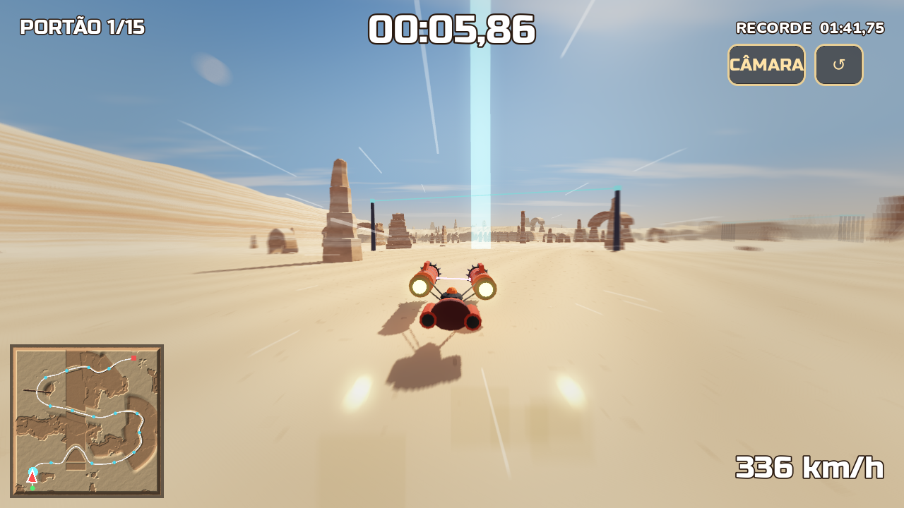

## Instalar no telemóvel (Android)

Descarregue `apk/RACESTARS.apk` no telemóvel e toque em **Instalar**
(se pedir, permita "instalar apps de fontes desconhecidas"). Jogue com o telemóvel deitado.

**Controlos:**
- **Metade esquerda do ecrã**: botões **◀ ▶** para virar.
- **Metade direita**: **TRAVÃO**.
- **CÂMARA** troca entre câmara de perseguição e primeira pessoa (cabine).
- **↺** recomeça a corrida.

**Travar é preciso.** Quanto mais rápido, mais aberta é a curva: nas curvas apertadas tem de travar antes.
Travar e virar ao mesmo tempo faz derrapar e fechar a curva.

## O mapa e os caminhos

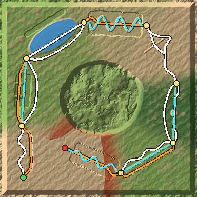

No minimapa, cada cor é um nível:
- branco = chão;
- laranja = pelo alto;
- azul tracejado = subterrâneo.

| Trecho | Paisagem | Caminhos |
|---|---|---|
| A | Deserto das dunas | estrada com dunas e saltos **ou** crista de areia com fendas para saltar |
| B | Colinas verdes | vale à volta **ou** túnel de 1 km por baixo da colina **ou** topo da colina: ruínas, fendas, ponte e salto do penhasco |
| C | Lago | estrada da margem **ou** caminho de pedra sobre a água, com arcos e falhas (pela água também dá, mais devagar) |
| D | Desfiladeiro de arenito | leito com curvas em gancho (é preciso travar) **ou** beira de cima com pontes de pedra, casas-ovo e um salto |
| E | Abismo | rampa para saltar o abismo **ou** desvio pela ponta; depois dunas com saltos |
| F | Selva do cenote | estrada da selva **ou** gruta que passa pelo fundo do cenote (com uma árvore gigante) **ou** ponte partida por cima |
| G | Prado do aqueduto | estrada entre ruínas e a torre **ou** tubo subterrâneo **ou** por cima do aqueduto, com uma falha para saltar |
| H | Fenda vermelha | fenda estreita com teto de pedra **ou** por cima com saltos, até à **META** |

- Fora dos caminhos vale tudo: o mapa é livre (montanhas nas bordas). No centro há um maciço com ilhas flutuantes.
- **Próximo portão:** coluna de luz azul; a seta no topo do ecrã e o minimapa ajudam a não perder o rumo.
- **Balizas:** marcam cada caminho com a cor do seu nível.
- **Choques:** raspar nas paredes faz perder velocidade; bater de frente, ou cair no abismo, volta ao último portão.
- **Recorde:** o melhor tempo fica guardado no aparelho.

| | |
|---|---|
| 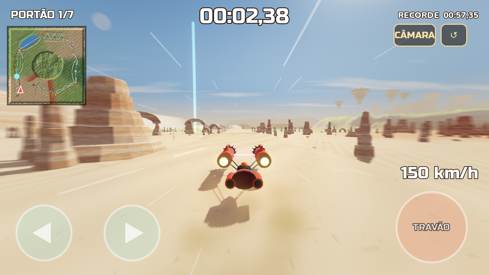 | 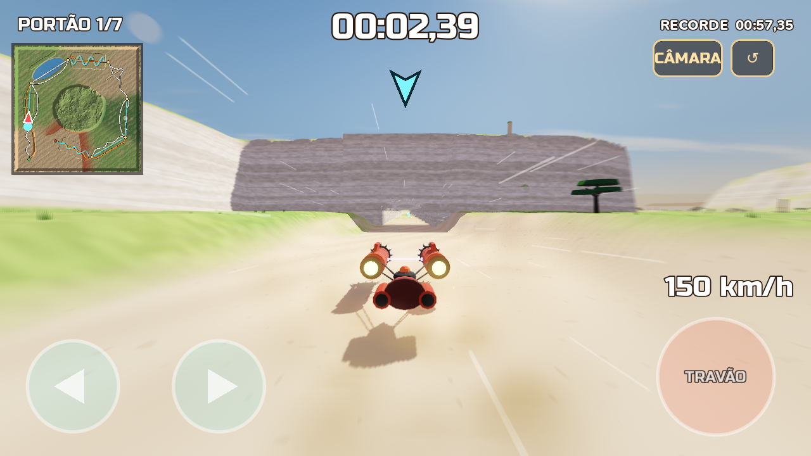 |
| 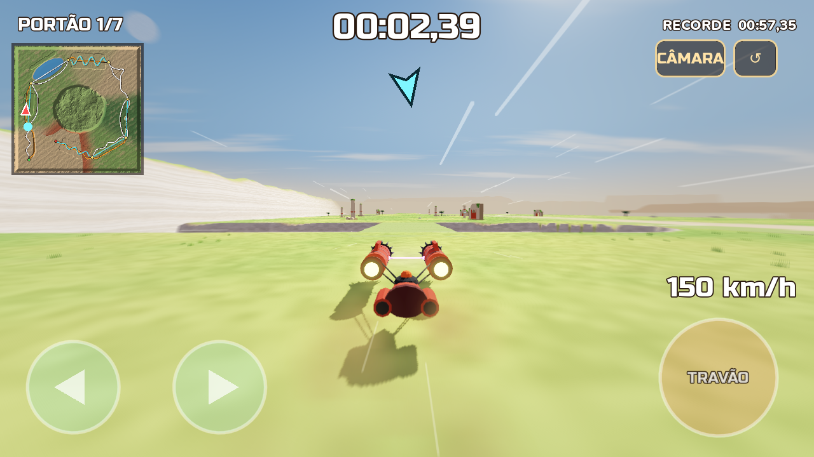 | 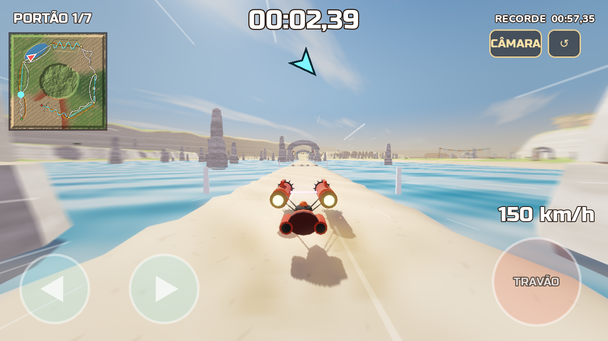 |
| 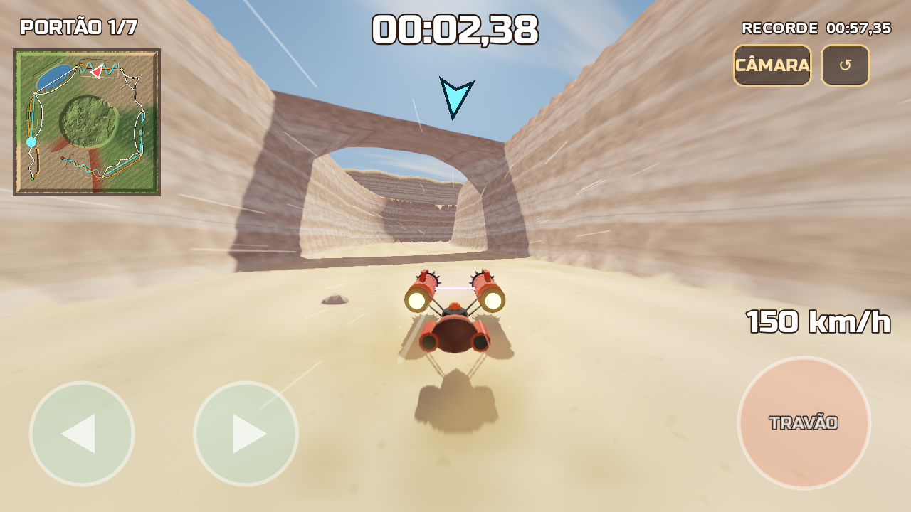 | 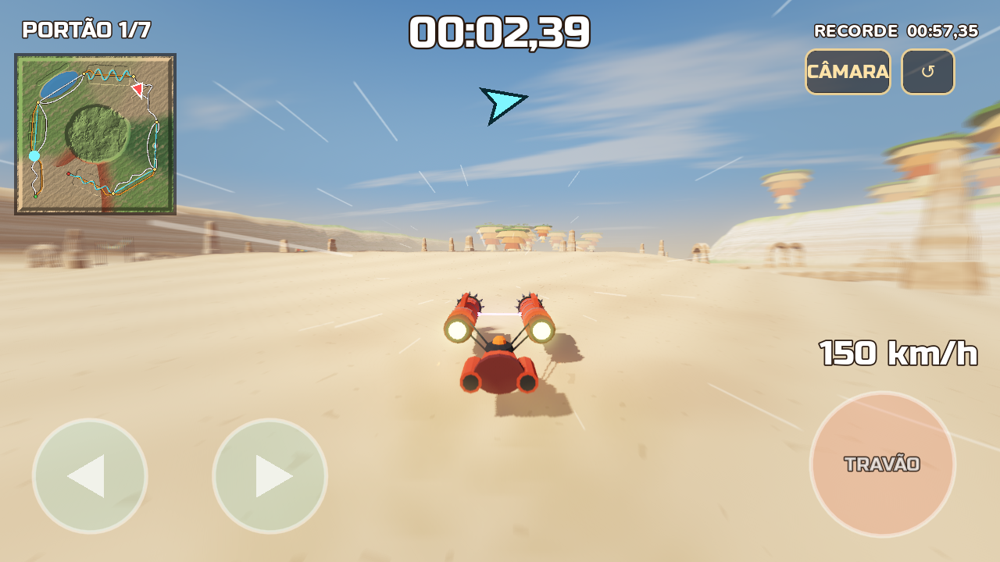 |
| 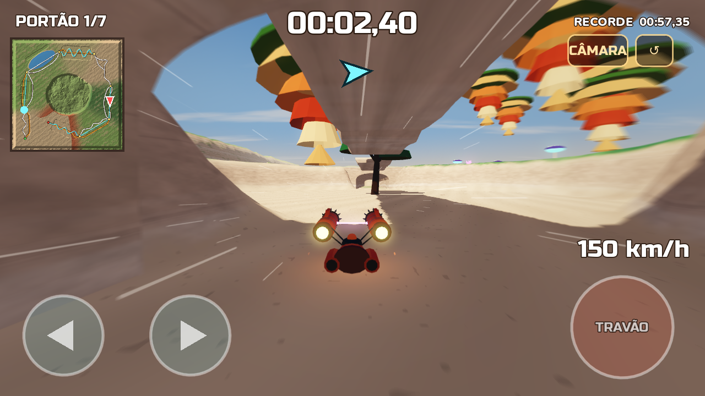 | 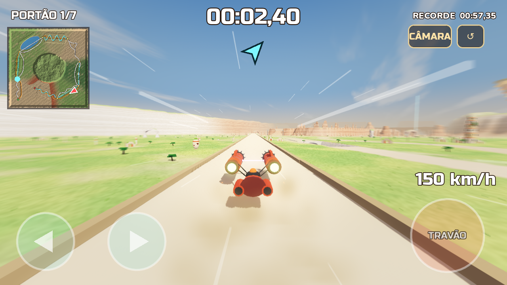 |
| 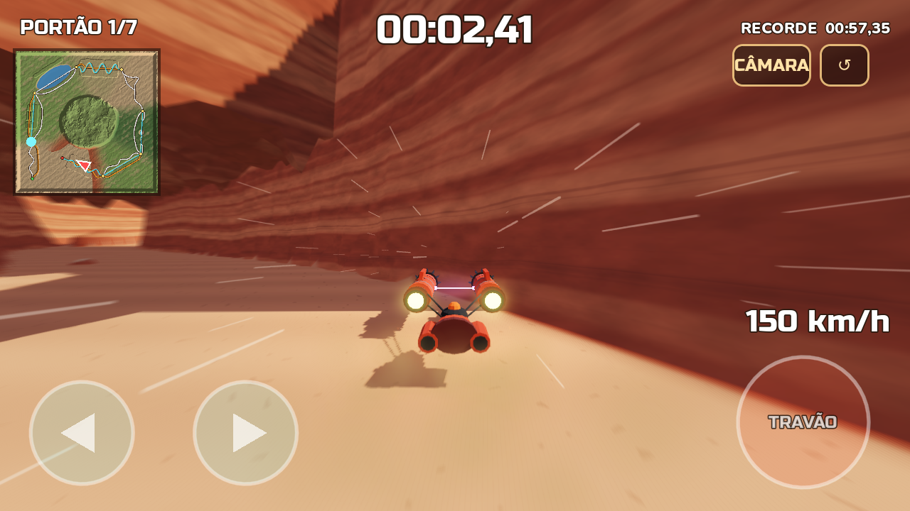 | 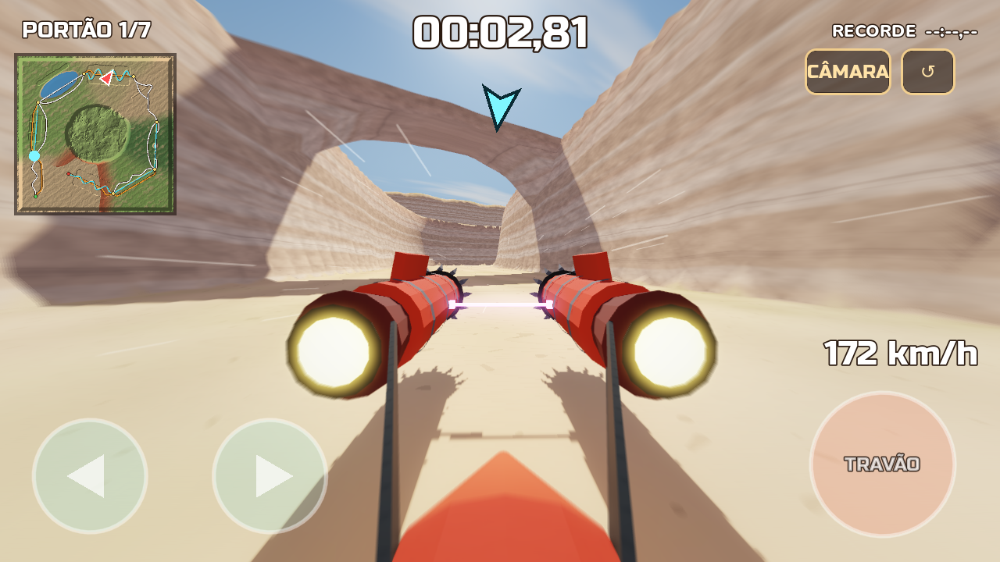 |
| 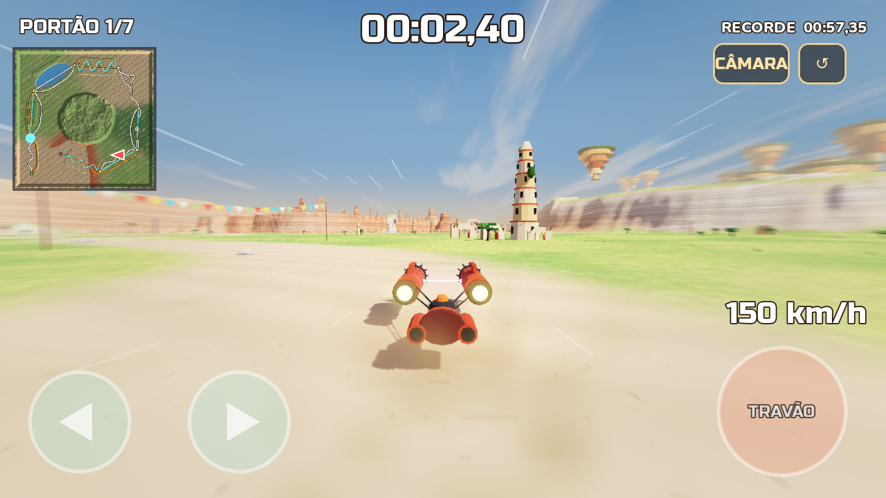 | 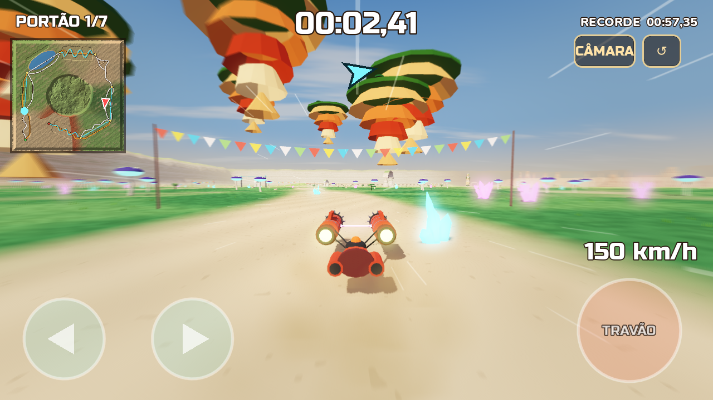 |

**Sensação de velocidade:**
- até 450 km/h;
- riscos de vento e poeira levantada;
- chamas das turbinas;
- borrão nas bordas do ecrã;
- câmara que abre e treme com a velocidade.

**Som:**
- turbinas que rugem, vento e música;
- contagem 3-2-1, sinal nos portões e fanfarra na chegada;
- aterragens, raspões e batidas;
- eco nos túneis.

**Desempenho no telemóvel:**
- **Terreno sem engasgos:** nada é construído durante a corrida. São 5 grelhas planas partilhadas, e a placa gráfica lê a altura de cada ponto de uma textura.
- **Shaders aquecidos:** são preparados durante a contagem, para não haver engasgos quando algo aparece pela primeira vez.
- **Qualidade automática:** se o telemóvel não aguentar, a qualidade baixa sozinha.

## Estrutura

| Pasta / ficheiro | O quê |
|-------|-------|
| `tools/make_map.py` | **Gera o mapa**: terreno, os 8 trechos com os caminhos de cada nível, túneis, pontes, aqueduto, lago, cenote, biomas, rochas, árvores, ruínas, relva e minimapa |
| `blender/build_assets.py` | **Modela no Blender** todas as peças (rochas, arcos, árvores, ruínas, torre, aqueduto, túneis e pontes à medida do mapa, o podracer "Vespa"), com cores |
| `blender/racestars_assets.blend` | As peças lado a lado para abrir/editar no Blender (5.0+) |
| `tools/make_sounds.py` | Sintetiza todos os sons e a música |
| `game/` | Projeto Godot 4.5 (renderizador Compatibility, pensado para telemóvel) |
| `game/scripts/race.gd` | Corrida: contagem, cronómetro, portões, recorde, voltar ao último portão |
| `game/scripts/terrain.gd` | Terreno 6 × 6 km deslocado na placa gráfica, com níveis de detalhe |
| `game/scripts/map.gd` | Coloca as peças, túneis, pontes, aqueduto, água, ilhas, relva, bandeirolas, portões e balizas |
| `game/scripts/podracer.gd` | Física do podracer (flutua, derrapa, trava, salta, flutua na água) e controlos de toque |
| `game/scripts/camera_rig.gd` | Câmara de perseguição e primeira pessoa |
| `game/scripts/hud.gd` | Cronómetro, portões, minimapa, seta, botões de toque |
| `game/shaders/` | Céu, terreno e rochas com cores por bioma, água, borrão de velocidade |

## Gerar tudo de novo

```bash
pip install numpy scipy pillow zstandard bpy==5.0.1
python tools/make_map.py              # mapa (game/assets/map/)
python blender/build_assets.py        # peças .glb (túneis e pontes à medida de map.json)
python tools/make_sounds.py           # sons
```

## Gerar o APK

```bash
godot --headless --path game --export-release "Android" ../build/RACESTARS-unsigned.apk
java -jar uber-apk-signer.jar --apks build/RACESTARS-unsigned.apk   # assina (v2/v3)
```

## Testes automáticos (opcional)

```bash
# piloto automático do início ao fim por um dos caminhos de cada trecho (0, 1, 2 ou "sorte")
godot --path game -- --autoplay --log --variant=1 --shots=5,20,45 --shotdir=/tmp/prints --quit=300
# começar no portão N, ou num ponto qualquer (x,z,direção[,altura]) e em primeira pessoa
godot --path game -- --autoplay --cp=4
godot --path game -- --at=-700,1150,1,0 --fpv
```
