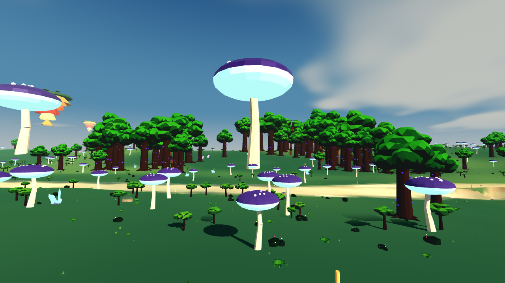
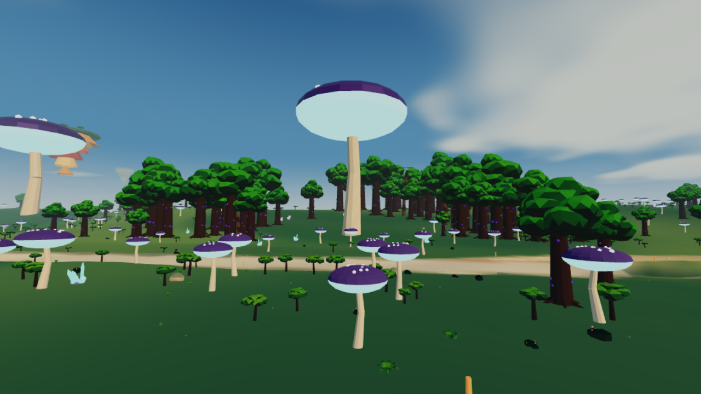

# Perfil A15 / Estável — versão 0.10

O perfil Leve mantinha MSAA em resolução integral, todos os lotes de cobertura
vegetal, alcance de terreno de 4,8 km e cálculos de materiais relativamente caros.
O novo perfil é uma opção adicional, não remove os perfis existentes.

## Orçamento

- Limite/meta de apresentação: 30 FPS; física e controlos continuam a 60 Hz.
- Resolução 3D inicial próxima de 600 linhas, limitada a 50–80% da resolução da
  janela. Em 1080p, aproximadamente 56%. Apenas a imagem 3D é reduzida, não o HUD.
- Após aquecimento, sobrecarga persistente reduz a escala em passos de 8%, com
  piso de 80% da escala inicial. Recuperação lenta após três janelas estáveis.
  O antigo sistema automático não troca este perfil de volta para Leve.
- Mantém MSAA 2× para contornos limpos na imagem reduzida. Sem pós-AA incompatível.
- Sem sombras dinâmicas do sol, probes locais, bloom ou borrão de velocidade.
  Uma sombra de contacto barata permanece debaixo do veículo.
- Partículas de propulsão/água/terra no orçamento baixo; seis partículas ambientais.
- Terreno desenhado até 3 km, com LOD mais cedo e nevoeiro que suaviza o horizonte.
- 30% da cobertura baixa, 40% da decoração pequena sem colisão; alcance menor.
  Árvores grandes, barreiras, pedras sólidas, pontes, megaconstruções e colisões mantidas.
- Materiais conservam as cores dos biomas e estratos, usando menos ruído e sem
  microrrelevo. O shader de terreno evita percorrer 24 retângulos de água neste perfil.
- Sair do perfil restaura resolução, densidades, LOD, sombras e limite de apresentação.

## Evidência

Godot 4.6.3, Compatibility, Mesa llvmpipe, 1280×720. Mesma câmera na floresta,
oito frames de aquecimento por perfil e média de seis frames seguintes.

| Medida da cena | Leve | A15 / Estável |
| --- | ---: | ---: |
| Chamadas de desenho/frame | 251 | 157 |
| Primitivas/frame | 1.337.766 | 711.558 |
| Escala 3D | 1,00 | 0,80 |
| Tempo/frame no renderizador **por software** | 529,8 ms | 325,5 ms |

São 37% menos chamadas e 47% menos primitivas nessa vista. Os tempos por software
servem somente para comparação nesta máquina; não predizem FPS no Galaxy A15.
Não foi possível testar temperatura, autonomia ou quedas de FPS num aparelho real.

| Leve | A15 / Estável |
| --- | --- |
|  |  |

18 verificações específicas passaram: identificação A15 4G/5G, orçamento,
resolução adaptativa/recuperação, preservação de colisões/posição e restauração
dos perfis. Também passaram 21 verificações visuais e 32 de física.
Os avisos de duas texturas OpenGL na saída já existiam na base.

Repetir: `godot --headless --path game --script ../tools/stable_profile_check.gd`.
Para medir a cena com renderização real:
`godot --path game --resolution 1280x720 --fixed-fps 30 --script ../tools/stable_render_check.gd`.
