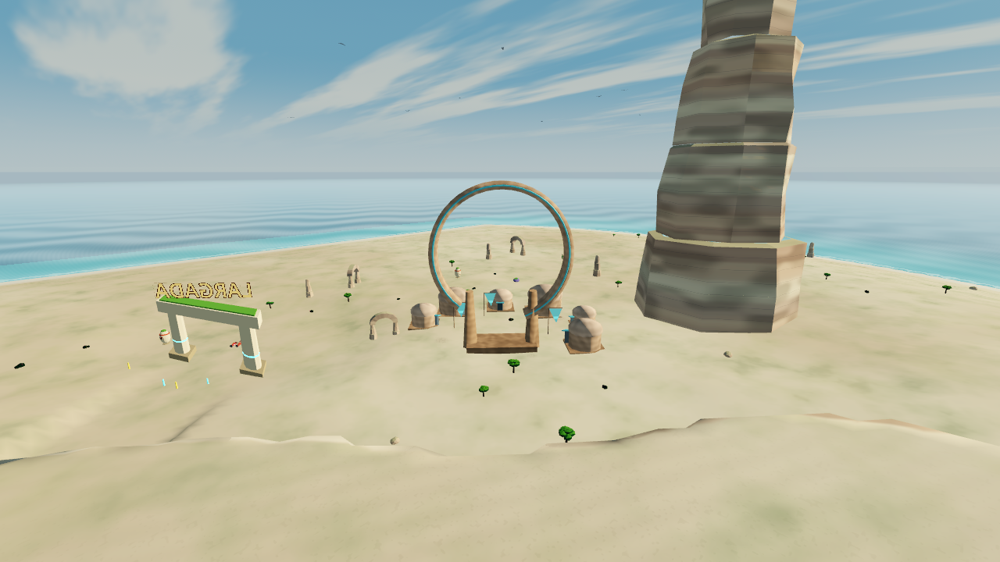
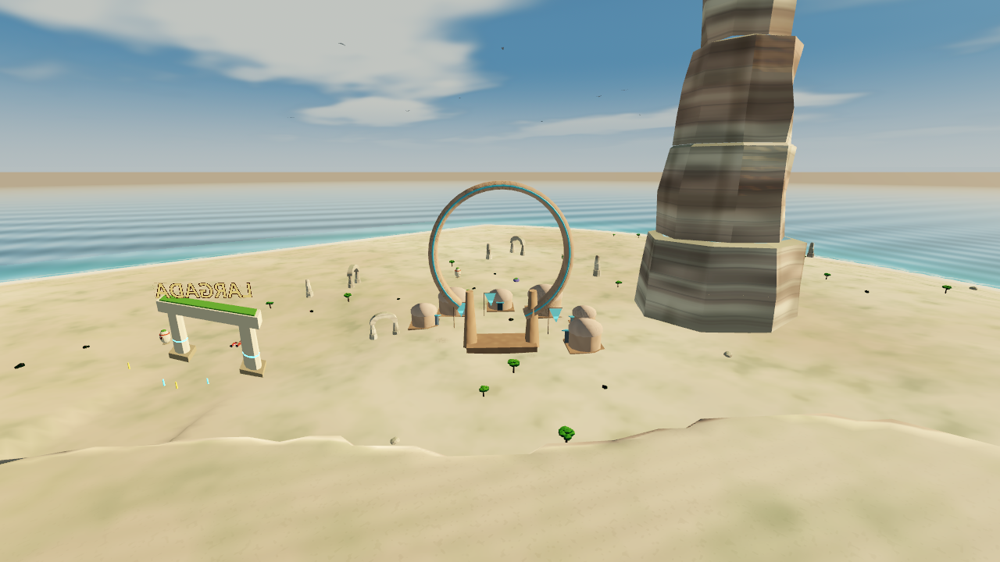
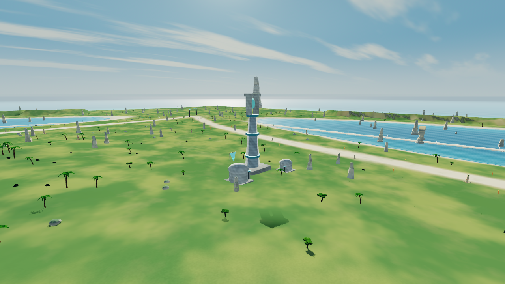
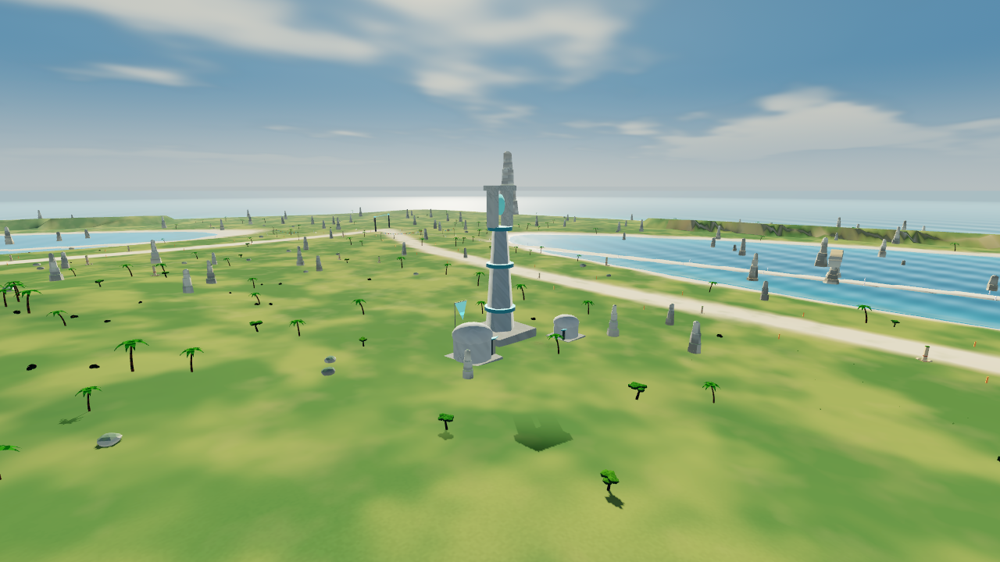
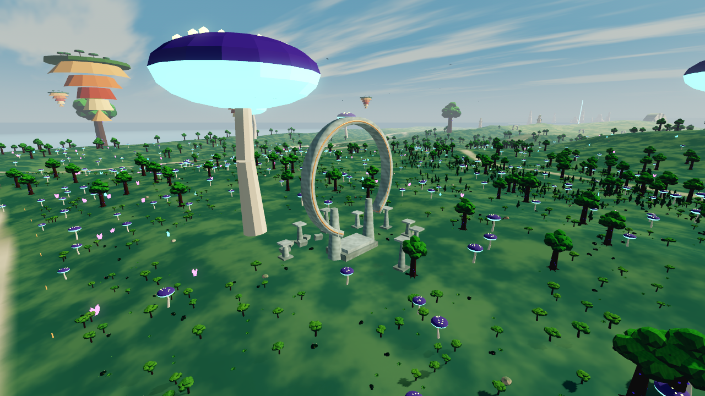
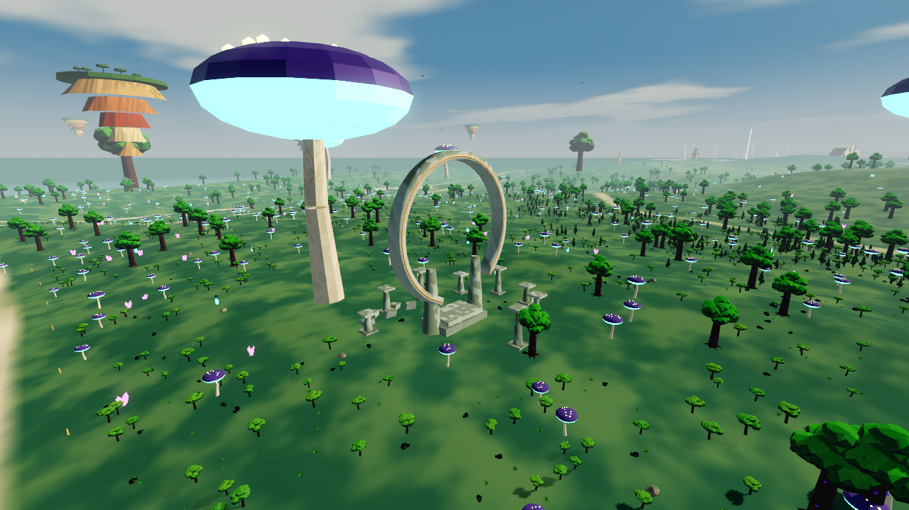

# Auditoria para a evolução cinematográfica

Base preservada: **v0.7**, commit `81f3094`. Implementação **v0.8**, na branch
`cinematic-world`, orientada pelas nove referências enviadas em 8/10/2026.
A direção combina pedra erodida, ruínas com vegetação, metal gasto e luz quente.
Esta entrega melhora os materiais e a atmosfera sobre os modelos existentes;
não reproduz o detalhe geométrico nem o fotorrealismo das imagens de referência.

| Sistema | Implementação atual | Orientação para a próxima alteração |
| --- | --- | --- |
| Geografia e biomas | `tools/make_map.py`, `tools/island.py`; dados em `game/assets/map`; `terrain.gd` e `map.gd` carregam o mundo | Não regenerar nem modificar heightmap, rotas, checkpoints, colisões ou costa. Trabalhar nos materiais. |
| Terreno | `terrain.gdshader`, mapa de biomas, malhas de terreno por setores | Melhorar transições de materiais, escala de detalhe e leitura de encostas mantendo vértices e alturas. |
| Rocha e montanhas | `rock.gdshader`, `rock_far.gdshader`, `rock_common.gdshaderinc`; variação por bioma, estratos e detalhe procedural | Refinar contraste, rugosidade e desgaste; conservar o detalhe reduzido à distância para evitar cintilação. |
| Pontes, túneis e monumentos | GLBs `ponte_*`, `tunel_*`, `piramide`, `obelisco`, `arch_*`, `colosso_*`; gerados originalmente em `blender/build_assets.py` | Preservar todos os GLBs e volumes de colisão. Camadas de desgaste/musgo podem ser materiais ou complementos visuais sem colisão. |
| Cenários da ilha | `island_scenery.gd`: 12 conjuntos; materiais de pedra, bandeiras e aves; `surface_wear.gd` | Integrar a paleta das referências sem mover estruturas nem invadir trajetórias. Emissão reservada à tecnologia. |
| Natureza | Árvores, arbustos, palmeiras, fetos e cobertura em GLBs/MultiMesh; `foliage.gdshader` anima vento | Melhorar materiais/contexto de vegetação; não substituir modelos nem remover instancing. |
| Água | `water.gdshader` para lagos; `ocean.gdshader`, máscara costeira e altura do terreno para mar/espuma | Ajustar profundidade, cor e reflexos sem alterar superfície física, nível de água ou túneis secos. Spray já distingue água de solo. |
| Iluminação e atmosfera | `environment_controller.gd`, `environment.tres`, céu procedural com planeta/anéis; `global_vfx.gd` | Manter o controlador existente. Adaptar cor/exposição/nevoeiro às referências, verificando legibilidade de pistas e nave. |
| Veículos | `model_materials.gd`, `vehicle_surface.gdshader`, materiais emissivos do modelo, `exhaust.gdshader` | Refinar pintura/metal/rugosidade e energia; não editar GLBs, suspensão, aceleração, travagem ou direção. |
| Câmera e velocidade | `camera_rig.gd`, `speed_fx_state.gd`, `speed_fx.gd`, `audio.gd` | Reutilizar o estado compartilhado e os eventos de boost/aterragem. Manter colisão de câmera e primeira pessoa. |

## Desempenho e perfis

O terreno tem cinco passos de LOD (1, 2, 4, 8, 16), com transições por
distância. Props/vegetação usam MultiMesh agrupados em células de 1 km e
alcances de visibilidade específicos; estruturas colossais continuam
visíveis a distâncias maiores. Isso deve ser preservado: acrescentar
detalhe em cada instância individual destruiria parte desse benefício.

Os perfis atuais são **Leve, Equilibrado e Alto**, persistidos por
`visual_quality.gd`. Controlam partículas, reflexos, sombras e MSAA.
Compatibility continua sendo o renderizador padrão no PC e no Android.
SSAO/SSIL/volumetria são condicionados a Forward+; não devem ser usados
como base obrigatória da nova aparência. Glow em Compatibility depende de
Godot 4.6+. Os limites atuais estão em `visual-systems.md`.

Há dois avisos de limpeza de textura na saída do renderer OpenGL por
software; estão documentados e não devem ser confundidos com validação
em um telefone. O desempenho real de Android/Windows ainda precisa ser
medido nos dispositivos alvo.

## Critérios de preservação

Comparar a futura alteração com a tag `v0.7`: arquivos de dados do mapa e
GLBs devem permanecer idênticos. Alterações de scripts devem se limitar à
apresentação. Verificar as vistas de perseguição/primeira pessoa, os três
perfis, solo/água/túnel e a legibilidade dos checkpoints. Reutilizar os
testes de câmera/efeitos e de perfis, além de uma corrida com os dados
exportados. Capturas comparáveis devem usar posição, orientação e horário
de iluminação iguais.

## Entrega 0.8

- Terreno e rochas: estratos deformados, variação mineral/erosão, musgo contextual,
  relevo nas normais e rugosidade húmida junto à água. Nenhum vértice de terreno mudou.
- Pedra de monumentos e colossos: desgaste, depósitos e microfissuras, com musgo
  orientado pelo mesmo mapa de biomas e pela inclinação. Emissão original preservada.
- Nave: metal escovado, pintura com desgaste discreto, poeira e diferenças de
  rugosidade; câmera, motores, partículas e física existentes mantidos.
- Água: ondas filtradas pelo tamanho do pixel, absorção por profundidade, reflexos
  do céu e espuma na costa real. Níveis físicos e máscara que mantém túneis secos intactos.
- Folhagem: vento limitado, variação orgânica e iluminação através das folhas.
  Distribuição, instancing, modelos e distâncias de visibilidade preservados.
- Céu: nuvens mais largas. Atmosfera: mistura suave por posição entre poeira de
  deserto, ar marítimo e nevoeiro húmido, sem recalcular o cubemap a cada mudança de zona.

| Trabalho no shader | Mobile / Leve | Médio / Equilibrado | Ultra / Alto |
| --- | --- | --- | --- |
| `cinematic_detail` | 0,35 | 0,65 | 1,0 |
| Oitavas da rocha | 2 | 3 | 4 |
| Ondas da água | 2 | 3 | 4 |
| Microdetalhe e projeção tripla | Reduzidos/desligados | Ativos | Ativos |
| Agitação fina das folhas | Desligada | Desligada | Ativa |

O detalhe desaparece progressivamente quando fica menor que o pixel. Esta é uma
redução de trabalho definida no código; ainda não é uma medição de FPS em hardware Android.

## Comparação no próprio jogo

Godot 4.6.3, Compatibility, 1280×720, perfil Equilibrado. Câmera, campo de visão,
posição do sol e mapa iguais em cada par. O nevoeiro foi ajustado ao bioma de cada
vista na versão nova. Animações de água/folhas não representam um teste pixel a pixel.

| Região | Antes (0.7) | Depois (0.8) |
| --- | --- | --- |
| Porto do Sol |  |  |
| Costa |  |  |
| Santuário |  |  |

Repetir: `godot --path game --script ../tools/visual_check.gd -- --quality=balanced --out=/tmp/capturas`.

## Verificação desta entrega

- 155 arquivos de mapa/modelos idênticos à tag v0.7; rotas, checkpoints e GLBs preservados.
- Funções de vértices de terreno/rocha idênticas à base; scripts de física,
  câmera e efeitos de velocidade sem alterações.
- 17 verificações de câmera/efeitos e 21 de sistema visual passaram.
- 23 sondagens físicas de oceano e túneis passaram; túneis continuam secos.
- Reta do Sal completa com os dados Windows exportados: chegada em 27,7 s.
- Arranque e condução nos circuitos Floresta e Monumentos conferidos por 12 s de
  corrida cada; não foram voltas completas.
- APK 0.8 ARM64, código 8: assinatura v2/v3 e alinhamento de 16 KiB validados.
- Instalador Windows extraído e executável/PCK idênticos ao export por SHA-256.
- Todos os shaders no APK e no PCK conferidos com os fontes finais.

Não houve execução em aparelho Android ou Windows nativo. Forward+, FPS nesses
dispositivos e corridas completas de longa duração ainda não foram validados.
Os dois avisos de limpeza OpenGL já existentes persistem; não houve erro de compilação
de shader ou script nas capturas dos três perfis.
O encerramento antecipado do teste Monumentos também deixou cinco recursos em uso;
o mesmo aviso ocorre no pacote 0.7, sem erros durante a condução.

Downloads e checksums estão no README e em `SHA256SUMS.txt`. A tag v0.7 continua
preservada para comparação ou retorno à versão anterior.
